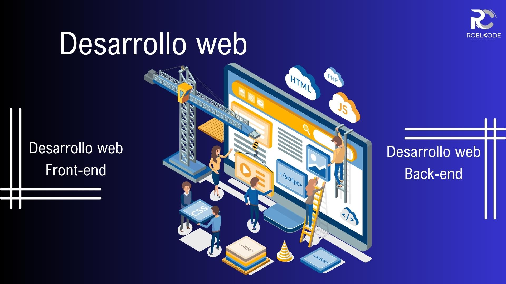
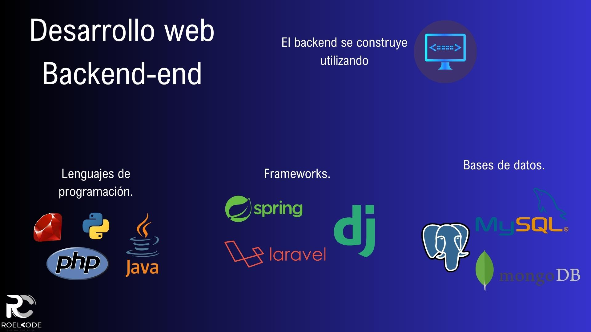
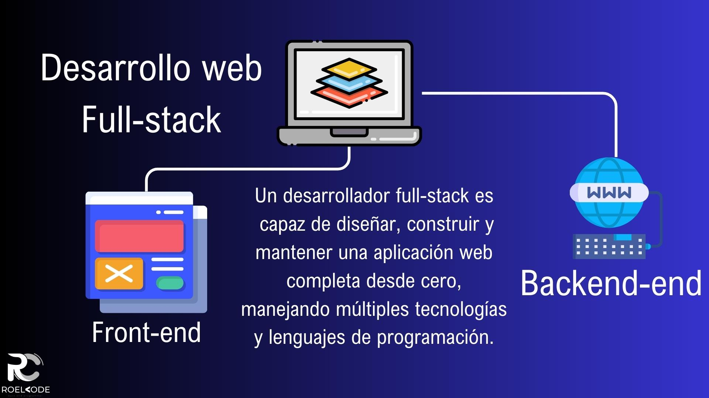

# Primeros pasos en la Web

1. [Introducción](#introducción)
2. [Introducción a la web](#introducción-a-la-web)
3. [Desarrollo web](#desarrollo-web)
4. [¿Qué necesitas para crear una página web?](#¿qué-necesitas-para-crear-una-página-web?)
5. [Herramienta para el desarrollo](#herramienta-para-el-desarrollo)
6. [Manejo de archivos](#manejo-de-archivos)
7. [Resumen](#resumen)

---

## Introducción

¡Bienvenidos al curso de HTML: Primeros pasos en la Web! En esta sección, aprenderemos los conceptos fundamentales para adentrarnos en el mundo de la creación de páginas web.

En la actualidad, la web se ha convertido en un medio esencial para comunicarnos, compartir información y realizar todo tipo de actividades. Para poder participar en este universo digital, es fundamental comprender los aspectos básicos del desarrollo web.

En este curso, nos enfocaremos en las herramientas y conocimientos necesarios para crear una página web desde cero. Empezaremos por responder a la pregunta clave: ¿qué necesitas para crear una página web?

A lo largo de las lecciones, exploraremos las herramientas y tecnologías más comunes utilizadas en el desarrollo web. Veremos cómo utilizar un editor de código y familiarizarnos con su interfaz. Además, aprenderemos sobre la estructura básica de un archivo HTML y cómo darle estilo con CSS.

También abordaremos el manejo de archivos, que es una parte fundamental del desarrollo web. Veremos cómo organizar y gestionar los archivos de nuestra página web de manera eficiente.

¡Estoy emocionado de acompañarlos en este viaje hacia el fascinante mundo de la web! Así que prepárate para adquirir los conocimientos necesarios para crear tus propias páginas web y dar tus primeros pasos en el desarrollo web. ¡Comencemos!

---

## Introducción en la web

La web es una red de información global y accesible a través de Internet, que permite a los usuarios compartir y acceder a información, comunicarse y realizar transacciones en línea. La World Wide Web, también conocida como WWW o simplemente web, es uno de los servicios más populares de Internet.

La web se basa en una arquitectura cliente-servidor, donde los clientes (navegadores web) solicitan y reciben información de los servidores web. Los servidores web alojan los sitios web y los contenidos de Internet, y proporcionan acceso a ellos a través de una dirección web o URL (Uniform Resource Locator).

Los sitios web están creados utilizando lenguajes de marcado, como HTML, que permiten a los desarrolladores web crear estructuras y formatos para la información. CSS (Cascading Style Sheets) se utiliza para definir la presentación visual de la página, y JavaScript se utiliza para hacer que los sitios web sean interactivos y dinámicos.

La web ha evolucionado rápidamente desde su creación en los años 90, y ha pasado de ser una simple colección de páginas estáticas a una plataforma sofisticada para la comunicación, el comercio electrónico y la colaboración en línea. La web también se ha vuelto más accesible, con tecnologías como la web móvil y las aplicaciones web progresivas, que permiten a los usuarios acceder a la web desde dispositivos móviles.

En resumen, la web es una red global de información accesible a través de Internet, que permite a los usuarios compartir información, comunicarse y realizar transacciones en línea. Está basada en una arquitectura cliente-servidor, y se utiliza HTML, CSS y JavaScript para crear y presentar la información en línea.

---

## Desarrollo web

El desarrollo web es el proceso de creación de sitios web para internet o para una intranet. Se refiere a todas las tareas involucradas en la creación de una página web, desde la conceptualización hasta el diseño, desarrollo, implementación y mantenimiento.

El desarrollo web se puede dividir en dos categorías principales: frontend, backend y full stack.

### Desarrollo frontend

El frontend se refiere a la parte de la página web que los usuarios pueden ver y con la que pueden interactuar. Incluye todo lo que se ve en la pantalla, desde el diseño y la apariencia visual hasta la funcionalidad y la experiencia del usuario.

El frontend se construye utilizando lenguajes de marcado, como HTML, que se utiliza para estructurar y organizar el contenido de la página web. CSS se utiliza para dar estilo y diseño a la página, y JavaScript se utiliza para añadir interactividad y funcionalidad dinámica a la página, como animaciones, efectos de desplazamiento y formularios interactivos.

Los desarrolladores de frontend se encargan de la creación y el mantenimiento de la parte visual y funcional de la página web, asegurándose de que la experiencia del usuario sea atractiva, intuitiva y fácil de usar. También deben estar al tanto de las últimas tendencias y tecnologías en diseño y desarrollo web para garantizar que las páginas web sean modernas y estén actualizadas.

En resumen, el frontend es la parte visible y funcional de una página web, construida con lenguajes de marcado como HTML, CSS y JavaScript. Los desarrolladores de frontend se encargan de crear y mantener la apariencia visual y la funcionalidad de la página web.

### Desarrollo backend

El backend, también conocido como servidor, es la parte de la arquitectura web que se encarga de la lógica y la funcionalidad que se ejecuta en el servidor y no es visible para el usuario final. Incluye la gestión de la base de datos, el procesamiento de formularios y solicitudes, la gestión de usuarios y autenticación, y la implementación de la lógica empresarial.

El backend se construye utilizando lenguajes de programación como PHP, Python, Ruby, Java, y frameworks como Laravel, Django, Ruby on Rails, Spring Boot, entre otros. También se utilizan bases de datos, como MySQL, PostgreSQL, MongoDB, para almacenar y gestionar la información.

Los desarrolladores de backend se encargan de la creación y el mantenimiento de la lógica y la funcionalidad detrás de las aplicaciones web, asegurándose de que se ejecuten correctamente y de manera eficiente. También deben tener en cuenta la seguridad y la escalabilidad de las aplicaciones web, así como la optimización del rendimiento y la gestión de errores.

En resumen, el backend es la parte de la arquitectura web que se encarga de la lógica y la funcionalidad que se ejecuta en el servidor y no es visible para el usuario final. Se construye utilizando lenguajes de programación y frameworks, y los desarrolladores de backend se encargan de la creación y el mantenimiento de la lógica y la funcionalidad detrás de las aplicaciones web.

### Desarrollo full stack

Un desarrollador full stack es aquel que tiene habilidades y experiencia tanto en el frontend como en el backend del desarrollo web. Es decir, tiene conocimientos tanto de la parte visible y funcional de la página web (frontend) como de la lógica y la funcionalidad que se ejecuta en el servidor (backend).

Un desarrollador full stack puede diseñar y construir una aplicación web completa desde cero, trabajando en todas las fases del ciclo de vida del desarrollo de software, desde la planificación y el diseño hasta la implementación y el mantenimiento. Además, puede manejar múltiples tecnologías y lenguajes de programación, y puede trabajar tanto en proyectos pequeños como en proyectos a gran escala.

Los desarrolladores full stack tienen una comprensión completa del funcionamiento de una aplicación web y cómo todas las partes interactúan entre sí. También pueden optimizar el rendimiento de la aplicación web, solucionar problemas técnicos y trabajar en la escalabilidad y seguridad de la aplicación.

En resumen, un desarrollador full stack es un profesional con habilidades y experiencia en el desarrollo de aplicaciones web tanto en el frontend como en el backend, capaz de diseñar, construir y mantener una aplicación web completa desde cero, manejando múltiples tecnologías y lenguajes de programación.

---

## ¿Qué necesitas para crear una página web?

Para crear una página web, necesitas los siguientes elementos:

- **Editores de texto**: Necesitas un editor de texto para escribir el código HTML, CSS y JavaScript de tu página web. Hay muchos editores disponibles, algunos populares son:

    - Visual Studio Code
    - Sublime Text
    - Atom
    - Vim

- **Navegador Web**: Para ver y probar tu página web, necesitas un navegador web como:

    - Chrome
    - Firefox
    - Safari
    - Edge

Es importante probar tu sitio en diferentes navegadores para asegurarte de que se vea y funcione bien en todos ellos.

- **Manejo de archivos**: Para crear una página web, debes saber cómo organizar y estructurar tus archivos. Es importante tener una estructura de carpetas bien definida que te permita mantener tu proyecto organizado y fácil de entender.

- **Conocimientos básicos de HTML, CSS y JavaScript**:

    - HTML (HyperText Markup Language) es el lenguaje utilizado para crear la estructura y contenido de tu página web.
    - CSS (Cascading Style Sheets) es el lenguaje utilizado para dar estilo a tu página web.
    - Con JavaScript, puedes agregar interactividad y dinamismo a tu página web.

- **Una herramienta de diseño gráfico**: Si quieres crear gráficos personalizados, como logotipos, imágenes o ilustraciones, necesitarás una herramienta de diseño gráfico, como:

    - Adobe Photoshop
    - Illustrator.
    
Sin embargo, esto no es estrictamente necesario para crear una página web básica.

- **Un servidor web para publicar tu página web**: Para que tu página web esté disponible en línea, necesitas un servidor web. Puedes alojar tu sitio en un servicio de alojamiento web, como:

    * GitHub Pages
    - Netlify
    - Firebase
    - Puedes configurar tu propio servidor web en una computadora o servidor remoto.

- **Un nombre de dominio**: Un nombre de dominio es la dirección que las personas utilizan para acceder a tu sitio web. Necesitas registrar un nombre de dominio y configurar la dirección para que apunte a tu servidor web.

En resumen, para crear una página web necesitas un editor de texto, conocimientos de HTML, CSS y JavaScript, un navegador web, un servidor web y un nombre de dominio. Con estos elementos, puedes crear y publicar tu propio sitio web.

---

## Herramienta para el desarrollo

Instalar herramientas de desarrollo es una parte importante para comenzar a crear páginas web. Aquí te dejo los pasos para instalar Firefox y Visual Studio Code, así como las extensiones recomendadas para Visual Studio Code:

### Instalar Firefox

- Abre tu navegador actual y dirígete a la página web de Mozilla Firefox: `https://www.mozilla.org/es-ES/firefox/new/`
- Haz clic en el botón "Descargar Firefox" y espera a que se descargue el archivo de instalación.
- Una vez descargado, haz doble clic en el archivo de instalación y sigue las instrucciones en pantalla para instalar Firefox en tu ordenador.

### Instalar Visual Studio Code

- Abre tu navegador y dirígete a la página web de Visual Studio Code: `https://code.visualstudio.com/`
- Haz clic en el botón "Descargar" para descargar el archivo de instalación.
- Una vez descargado, haz doble clic en el archivo de instalación y sigue las instrucciones en pantalla para instalar Visual Studio Code en tu ordenador.

### Instalar extensiones de Visual Studio Code

Después de instalar Visual Studio Code, puedes instalar las extensiones recomendadas para trabajar con HTML, CSS y JavaScript:

- Abre Visual Studio Code y haz clic en el icono de extensiones en la barra lateral o presiona "Ctrl + Shift + X" en Windows o "Cmd + Shift + X" en Mac.
- En la barra de búsqueda, escribe el nombre de la extensión que deseas instalar. Para este caso, escribe "Live Server", "Tokyo Night" y "vscode-icons".
- Haz clic en "Instalar" junto a cada extensión recomendada y espera a que se instale.
- Una vez instaladas, reinicia Visual Studio Code para que las extensiones surtan efecto.

Con estas herramientas y extensiones, estarás listo para comenzar a crear y desarrollar páginas web con facilidad.

---

## Manejo de archivos

El manejo de archivos es una parte importante del desarrollo web, ya que necesitas organizar tus archivos para que tu sitio web funcione correctamente. Aquí te dejo algunas consideraciones sobre el manejo de archivos:

### ¿Dónde debería estar tu sitio web en tu ordenador?

Para organizar tus proyectos de manera efectiva, es recomendable que crees un espacio de trabajo en tu ordenador. Puedes crear una carpeta específica en tu disco duro para tus proyectos web, como:

- `sitios-web `
- `proyectos-web`
- `workspaces`

Dentro de esta carpeta, puedes crear subcarpetas para cada proyecto que estés trabajando, por ejemplo, `mi-blog` o `sitio-de-mi-negocio`, etc.

### Estructura de un proyecto web

Una buena práctica es seguir una estructura de carpetas consistente en tus proyectos web. Aquí te dejamos una posible estructura:

* Nombre del proyecto (por ejemplo, `my-web`)

    * `img/images` para imágenes
    * `css/styles`para archivos CSS
    * `js/script` para archivos JavaScript
    * `index.html` como página principal de tu sitio web

Siguiendo esta estructura, es más fácil encontrar y modificar archivos específicos y mantener un orden en tu proyecto web.

Pasa a crear tu primer proyecto:

---

## Resumen

En el curso de HTML: Primeros pasos en la Web, exploramos los conceptos fundamentales necesarios para adentrarnos en el mundo del desarrollo web. Durante esta sección, nos enfocamos en proporcionar a los estudiantes las herramientas y conocimientos necesarios para crear una página web desde cero.

Abordamos la pregunta esencial: ¿qué se necesita para crear una página web? A lo largo de las lecciones, los participantes aprendieron sobre las herramientas y tecnologías más comunes utilizadas en el desarrollo web, así como el uso de un editor de código y su interfaz.

Además, se exploró la estructura básica de un archivo HTML y cómo darle estilo con CSS. Los estudiantes adquirieron habilidades para organizar y gestionar eficientemente los archivos de una página web.

El curso brindó una introducción emocionante al fascinante mundo de la web, permitiendo a los participantes desarrollar sus propias páginas web y dar sus primeros pasos en el desarrollo web.
