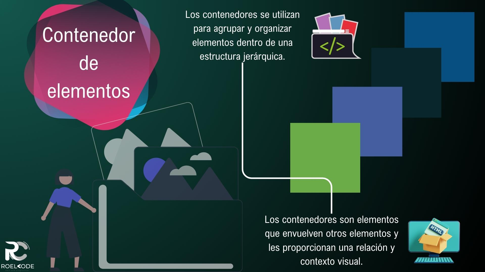
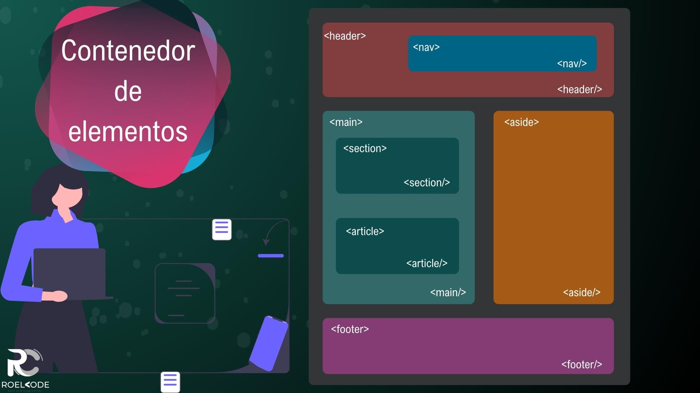
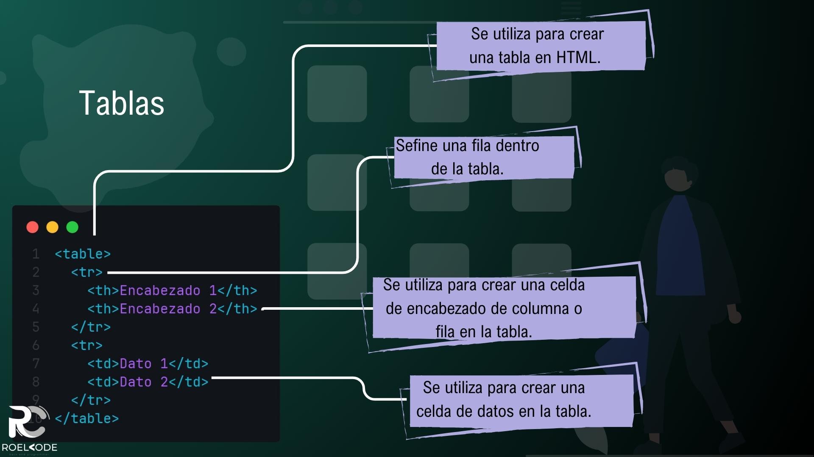

# Estructura de una página

1. [Introducción](#introducción)
2. [Contenedor de elementos](#contenedor-de-elementos)
3. [Etiquetas de enlace](#etiquetas-de-enlace)
4. [Etiquetas de listas](#etiquetas-de-listas)
5. [Elemento de citas](#elemento-de-citas)
6. [Tablas](#tablas)
7. [Proyecto Restaurante](#proyecto-restaurante)
8. [Resumen](#resumen)

---

## Introducción

¡Bienvenidos al Curso de HTML!

En esta sección del curso, aprenderemos sobre la estructura básica de una página HTML y las etiquetas que nos permitieron organizar y presentar nuestro contenido de manera efectiva.

Contenedor de elementos:

Utilizamos la etiqueta `
` para crear contenedores o secciones en nuestra página web. Estos contenedores no permitieron agrupar y organizar otros elementos HTML.
Etiquetas de enlace:

Utilizamos la etiqueta `<a>` para crear enlaces o hipervínculos a otras páginas web. Pudimos especificar la URL de destino utilizando el atributo href.
Etiquetas de listas:

Utilizamos las etiquetas `<ul>`y para crear listas ordenadas y no ordenadas `<ol>`. representó una lista sin orden específico, representó una lista ordenada con números o letras, y representó cada elemento de la lista.`<li><ul><ol><li>`
Elemento de citas:

Utilizamos la etiqueta `<blockquote>` para citar texto en nuestra página. También pudimos usar la etiqueta `<q>` para citas más cortas y la etiqueta `<cite>` para indicar la fuente de la cita.
Tablas:

Utilizamos la etiqueta `<table>`para crear tablas en HTML. Pudimos definir filas con la etiqueta `<tr>`, encabezados de columna con `<th>`, y celdas regulares con `<td>`. Además, pudimos utilizar las etiquetas `<caption>`, `<thead>`, `<tbody>`, y `<tfoot>` para proporcionar más estructura y contexto a nuestras tablas.
Con estos conceptos y etiquetas, pudiste crear una estructura sólida y organizada en tus páginas HTML. ¡Espero que hayas aprendido mucho y puedas aplicar estos conocimientos en tus proyectos futuros!

---

## Contenedor de elementos

En HTML, los contenedores se utilizan para agrupar y organizar elementos dentro de una estructura jerárquica. Los contenedores son elementos que envuelven otros elementos y les proporcionan una relación y contexto visual. A continuación, se describen algunos de los contenedores más comunes en HTML:

* `
:` El elemento `
` es un contenedor genérico que no tiene ninguna semántica específica asociada. Se utiliza para agrupar y dividir secciones de contenido sin un significado especial. El `
` es muy flexible y se utiliza ampliamente en la construcción de diseños y estructuras de página.

* `:` El elemento `` también es un contenedor genérico, pero se utiliza para agrupar elementos de texto o partes de texto dentro de un párrafo u otro elemento de texto. A diferencia de `
`, `` no agrega ninguna estructura o estilo específico.

* `<section>:` El elemento `<section>` se utiliza para agrupar contenido temáticamente relacionado dentro de una página. Puede representar una sección independiente, como un artículo, una parte de una página o un componente autónomo.

* `<article>:` El elemento `<article>` se utiliza para representar un contenido independiente y autocontenido dentro de una página. Puede ser un artículo de noticias, una publicación de blog o cualquier otro contenido que pueda existir de forma independiente.

* `<header>:` El elemento `<header>` se utiliza para representar la cabecera de una sección o de toda la página. Contiene elementos como el logotipo, el título de la página, los menús de navegación y otros elementos de encabezado.

* `<footer>:` El elemento `<footer>` se utiliza para representar el pie de página de una sección o de toda la página. Contiene elementos como información de derechos de autor, enlaces de contacto, enlaces de navegación adicionales y otros elementos de pie de página.

Para agregar la información de derechos de autor en el pie de página, puedes utilizar el elemento `<footer>` y agregar el texto correspondiente. Aquí tienes un ejemplo:

~~~html
<footer>
  
&copy; 2023 Nombre de tu empresa. Todos los derechos reservados.

</footer>
~~~

En este ejemplo, se utiliza el elemento `<footer>` para envolver el contenido del pie de página. El texto dentro del párrafo `
` representa la información de derechos de autor. El símbolo "©" es el código HTML para el símbolo de derechos de autor.

* `<nav>:` El elemento `<nav>` se utiliza para representar una sección de navegación, que contiene enlaces a otras páginas o secciones dentro del sitio web.

* `<aside>:` El elemento `<aside>` se utiliza para representar contenido secundario o complementario que está relacionado con el contenido principal de la página, pero que puede existir de forma independiente. Puede contener elementos como barras laterales, anuncios o información adicional.

---

## Etiquetas de enlace

Las etiquetas de enlace en HTML se utilizan para crear hipervínculos o enlaces a otras páginas, recursos o ubicaciones dentro de un sitio web. A continuación, se describen las etiquetas de enlace más comunes en HTML:

* `<a>:` La etiqueta `<a>` es la etiqueta principal para crear enlaces en HTML. Se utiliza junto con el atributo href para especificar la URL a la que se debe dirigir el enlace. Aquí tienes un ejemplo:

  ~~~html
  <a href="https://www.ejemplo.com">Enlace a otro sitio web</a>
  ~~~

  * **title:**
  El atributo title se utiliza para proporcionar información adicional sobre el enlace. Cuando el usuario pasa el cursor sobre el enlace, se mostrará un mensaje emergente con el texto del atributo title.

  ~~~html
  <a href="https://www.ejemplo.com" title="Visitar ejemplo.com">Enlace con título</a>
  ~~~

  * **_self (valor predeterminado):**
  Cuando no se especifica ningún atributo de destino, el enlace se abrirá en la misma ventana o pestaña en la que se encuentra el enlace. Es el comportamiento predeterminado si no se especifica ningún atributo de destino.

  ~~~html
  <a href="https://www.ejemplo.com">Enlace</a>
  ~~~

  * **_blank:**
  El atributo _blank hace que el enlace se abra en una nueva ventana o pestaña del navegador. Esto permite que el usuario siga en la página actual mientras accede al enlace.

  ~~~html
  <a href="https://www.ejemplo.com" target="_blank">Enlace</a>
  ~~~

  * **_parent:**

  El atributo _parent se utiliza cuando se trabaja con marcos (`<frameset>` o `<iframe>`) y hace que el enlace se abra en el marco principal que contiene el enlace.

  ~~~html
  <a href="https://www.ejemplo.com" target="_parent">Enlace</a>
  ~~~

  * **_top:**
  El atributo _top se utiliza también en el contexto de marcos y hace que el enlace se abra en la ventana completa del navegador, reemplazando todos los marcos existentes.

  ~~~html
  <a href="https://www.ejemplo.com" target="_top">Enlace</a>
  ~~~

  * **rel:**
  El atributo rel se utiliza para indicar la relación entre el documento actual y el destino del enlace. Algunos valores comunes de rel incluyen:
  
    * nofollow: Indica a los motores de búsqueda que no sigan el enlace.

    * noopener: Se utiliza para prevenir ataques de seguridad cuando se abre un enlace en una nueva ventana o pestaña utilizando target="_blank".

    * external: Indica que el enlace apunta a un recurso externo.

    ~~~html
    <a href="https://www.ejemplo.com" rel="nofollow">Enlace sin seguimiento</a>
    ~~~

---

## Etiquetas de listas

Las etiquetas de listas en HTML se utilizan para crear listas y organizar el contenido de una manera estructurada. Hay tres tipos principales de listas en HTML: listas desordenadas (`<ul>`), listas ordenadas (`<ol>`) y listas de definición (`<dl>`). A continuación, se describe cada una de estas etiquetas en detalle:

* Listas desordenadas (`<ul>`):
  * La etiqueta `<ul>` se utiliza para crear una lista desordenada, donde los elementos se presentan sin un orden específico.
  * Cada elemento de la lista se define utilizando la etiqueta `<li>` (elemento de lista).
  * Los elementos de la lista se representan con viñetas o puntos por defecto, aunque esto se puede personalizar utilizando CSS.
  * Aquí tienes un ejemplo:

  ~~~html
  <ul>
    <li>Elemento 1</li>
    <li>Elemento 2</li>
    <li>Elemento 3</li>
  </ul>
  ~~~

* Listas ordenadas (`<ol>`):
  * La etiqueta `<ol>` se utiliza para crear una lista ordenada, donde los elementos se presentan en un orden numérico o alfabético.
  * Cada elemento de la lista se define utilizando la etiqueta `<li>` (elemento de lista), de la misma manera que en las listas desordenadas.
  * Los elementos de la lista se numeran automáticamente según el tipo de lista especificado (por defecto, se utiliza numeración decimal).
  * Aquí tienes un ejemplo:

  ~~~html
  <ol>
    <li>Elemento 1</li>
    <li>Elemento 2</li>
    <li>Elemento 3</li>
  </ol>
  ~~~

* Listas de definición (`<dl>`):
  * La etiqueta `<dl>` se utiliza para crear una lista de definición, que consiste en términos y sus respectivas definiciones.
  * Cada término se define utilizando la etiqueta `<dt>` (término de lista), y cada definición se define utilizando la etiqueta `<dd>` (definición de lista).
  * Los términos y las definiciones se presentan en un formato de lista, donde los términos se muestran en negrita o con estilo especial.
  * Aquí tienes un ejemplo:

~~~html
<dl>
  <dt>Término 1</dt>
  <dd>Definición 1</dd>
  <dt>Término 2</dt>
  <dd>Definición 2</dd>
</dl>
~~~

Los atributos comunes utilizados en las etiquetas de listas en HTML son los siguientes:

* **type:** Este atributo se utiliza en la etiqueta `<ol>` (lista ordenada) para especificar el tipo de numeración o viñetas que se mostrarán. Los valores posibles son:

  * `1` (números arábigos, valor predeterminado)
  * `A` (letras mayúsculas)
  * `a` (letras minúsculas)
  * `I` (números romanos en mayúsculas)
  * `i` (números romanos en minúsculas)

  ~~~html
  <ol type="A">
    <li>Elemento 1</li>
    <li>Elemento 2</li>
    <li>Elemento 3</li>
  </ol>

  ~~~

* **start:** Este atributo se utiliza en la etiqueta `<ol>` para especificar el número de inicio de la lista. Por ejemplo, si se establece start="3", la lista comenzará en el número 3 en lugar del número 1.

  ~~~html
  <ol start="3">
    <li>Elemento 1</li>
    <li>Elemento 2</li>
    <li>Elemento 3</li>
  </ol>

  ~~~

* **reversed:** Este atributo se utiliza en la etiqueta `<ol>` y cambia el orden de la numeración. Cuando se establece como reversed, los números se muestran en orden descendente.

  ~~~html
  <ol reversed>
    <li>Elemento 1</li>
    <li>Elemento 2</li>
    <li>Elemento 3</li>
  </ol>
  ~~~

* **compact:** Este atributo se utiliza en la etiqueta `<ol>` o `<ul>` para especificar que se desea una representación más compacta de la lista, sin espacios adicionales entre los elementos de la lista.

  ~~~html
  <ul compact>
    <li>Elemento 1</li>
    <li>Elemento 2</li>
    <li>Elemento 3</li>
  </ul>
  ~~~

* **value:** Este atributo se utiliza en la etiqueta `<li>` para especificar el valor del elemento de la lista. Se utiliza principalmente en listas ordenadas (`<ol>`) para cambiar el valor de un elemento de lista específico.

  ~~~html
  <ol>
    <li value="100">Elemento 1</li>
    <li value="200">Elemento 2</li>
    <li value="300">Elemento 3</li>
  </ol>
  ~~~

Estas etiquetas de listas te permiten organizar el contenido de tu página web de manera estructurada y semántica. Puedes aplicar estilos a estas listas utilizando CSS para adaptar su apariencia según tus necesidades.

---

## Elemento de citas

En HTML, existen varios elementos específicos para marcar y dar formato a las citas dentro de un documento. A continuación, se describen los elementos más comunes utilizados para las citas en HTML:

* `<blockquote>:` El elemento `<blockquote>` se utiliza para representar una sección de texto que se ha extraído o citado de otra fuente. Por lo general, se muestra con sangría en los márgenes izquierdo y derecho. Aquí tienes un ejemplo:

~~~html
<blockquote>
  
Este es un texto citado.

  <footer>Nombre de la fuente</footer>
</blockquote>
~~~

* `<q>:` El elemento `<q>` se utiliza para marcar una cita corta dentro del texto. Por lo general, se muestra entre comillas en la línea del texto. Aquí tienes un ejemplo:

~~~html

Según <q>lorem ipsum dolor sit amet</q>,...

~~~

* `<cite>`: El elemento `<cite>` se utiliza para marcar el título de una obra o la referencia de una cita. No se utiliza para marcar el autor de una cita, para eso se puede utilizar `<footer>` u otro elemento similar. Aquí tienes un ejemplo:

~~~html

El libro <cite>Título del libro</cite> escrito por Autor.

~~~

* `<abbr>`: El elemento `<abbr>` se utiliza para marcar una abreviatura o acrónimo dentro del texto. Puede incluir un atributo title para proporcionar una descripción completa de la abreviatura. Aquí tienes un ejemplo:

~~~html

La <abbr title="Organización de las Naciones Unidas">ONU</abbr> es una organización internacional.

~~~

`<address>`: La etiqueta `<address>` se utiliza para especificar información de contacto o detalles de ubicación, como la dirección de correo electrónico, dirección física, número de teléfono, etc. Se recomienda que el contenido dentro de la etiqueta `<address>` esté en formato de bloque.

~~~html
<address>
  
John Doe

  
<a href="mailto:john@example.com">john@example.com</a>

  
123 Main Street, City

</address>
~~~

Estos son algunos de los elementos más utilizados para marcar y dar formato a las citas en HTML. Al utilizar estos elementos correctamente, no solo le das estilo visual a las citas, sino que también proporcionas un significado semántico a tu contenido, lo cual es importante para la accesibilidad y la interpretación correcta de tu página web.

---

## Tablas

Las tablas en HTML se utilizan para organizar y presentar datos en forma de filas y columnas. Son especialmente útiles para mostrar información tabular y estructurada. A continuación, te proporciono información sobre cómo crear y estructurar tablas en HTML:

* Elementos principales de una tabla:
  * `<table>`: El elemento `<table>` se utiliza para crear una tabla en HTML. Es el contenedor principal de la tabla y engloba todos los demás elementos relacionados con la misma.

  * `<tr>`: El elemento `<tr>` define una fila dentro de la tabla. Contiene las celdas de la fila.

  * `<th>`: El elemento `<th>` se utiliza para crear una celda de encabezado de columna o fila en la tabla. Por lo general, se muestra en negrita y con formato especial.

  * `<td>`: El elemento `<td>` se utiliza para crear una celda de datos en la tabla. Contiene el contenido de la celda.

* Estructura básica de una tabla:

~~~html
<table>
  <tr>
    <th>Encabezado 1</th>
    <th>Encabezado 2</th>
  </tr>
  <tr>
    <td>Dato 1</td>
    <td>Dato 2</td>
  </tr>
</table>
~~~

En este ejemplo, se crea una tabla con una fila de encabezado que contiene dos celdas de encabezado (`<th>`) y una fila de datos con dos celdas de datos (`<td>`).

* Atributos adicionales para tablas:
  * **colspan**: El atributo colspan se utiliza para especificar la cantidad de columnas que debe ocupar una celda.
  * **rowspan:** El atributo rowspan se utiliza para especificar la cantidad de filas que debe ocupar una celda.
  * **caption:** El elemento `<caption>` se utiliza para agregar un título o descripción a la tabla.
  * **thead, tbody, tfoot:** Estos elementos se utilizan para dividir la tabla en secciones de encabezado (`<thead>`), cuerpo (`<tbody>`) y pie (`<tfoot>`).
Aquí tienes un ejemplo que muestra el uso de algunos de estos atributos y elementos adicionales:

~~~html
<table>
  <caption>Tabla de ejemplo</caption>
  <thead>
    <tr>
      <th>Encabezado 1</th>
      <th colspan="2">Encabezado 2</th>
    </tr>
  </thead>
  <tbody>
    <tr>
      <td rowspan="2">Dato 1</td>
      <td>Dato 2</td>
      <td>Dato 3</td>
    </tr>
    <tr>
      <td>Dato 4</td>
      <td>Dato 5</td>
    </tr>
  </tbody>
  <tfoot>
    <tr>
      <td colspan="3">Pie de tabla</td>
    </tr>
  </tfoot>
</table>
~~~

Recuerda que puedes agregar estilos CSS a las tablas para personalizar su apariencia según tus necesidades.

Esto es solo una introducción básica a las tablas en HTML. Hay muchos otros elementos y atributos relacionados con las tablas que puedes explorar para crear tablas más complejas y personalizadas.

---

## Proyecto Restaurante

Si deseas crear un enlace interno dentro de la misma página, puedes utilizar el símbolo "#" seguido de un identificador único de un elemento en la página. Esto se conoce como anclaje.

Aquí tienes un ejemplo de cómo usar la etiqueta `<a>` con el símbolo "#" para crear un enlace interno:

~~~html
<!DOCTYPE html>
<html>
<head>
  <title>Ejemplo de enlace interno con la etiqueta <a></title>
</head>
<body>
  <h1>Contenido de la página</h1>

  
<a href="#seccion1">Ir a la Sección 1</a>

  
<a href="#seccion2">Ir a la Sección 2</a>

  
<a href="#seccion3">Ir a la Sección 3</a>

  <h2 id="seccion1">Sección 1</h2>
  
Contenido de la Sección 1

  <h2 id="seccion2">Sección 2</h2>
  
Contenido de la Sección 2

  <h2 id="seccion3">Sección 3</h2>
  
Contenido de la Sección 3

</body>
</html>
~~~

El atributo id en HTML se utiliza para proporcionar un identificador único a un elemento en el documento. Este identificador se utiliza para referenciar el elemento desde otros lugares del código, como enlaces internos, estilos CSS o scripts.

El valor del atributo id debe ser único dentro del documento HTML, lo que significa que no debe haber otro elemento con el mismo id.

El uso del atributo id es útil cuando queremos realizar alguna acción específica con un elemento o cuando necesitamos crear enlaces internos que apunten a un elemento específico en la página.

En este ejemplo, los enlaces "Ir a la Sección 1", "Ir a la Sección 2" e "Ir a la Sección 3" se crean utilizando la etiqueta `<a>` y el atributo href con el símbolo "#". Los identificadores únicos (en este caso, id) se asignan a los elementos de las secciones correspondientes. Al hacer clic en los enlaces, el navegador se desplazará automáticamente hacia la sección correspondiente en la misma página.

~~~html
<!DOCTYPE html>
<html lang="en">
<head>
  <meta charset="UTF-8">
  <meta name="viewport" content="width=device-width, initial-scale=1.0">
  <title>Sabores del Mundo</title>
</head>
<body>

  <header>
    <h1>Sabores del Mundo</h1>
    

      Sabores del Mundo es un restaurante único y emocionante que te invita a explorar una variedad de sabores y culturas culinarias en un solo lugar. Nuestro concepto se centra en ofrecer a nuestros comensales una experiencia gastronómica diversa y auténtica, donde podrán disfrutar de deliciosos platos de diferentes partes del mundo.
    

  
    <nav>
      <ul>
        <li><a href="#Menú">Menú</a></li>
        <li><a href="#Ubicacion">Ubicación</a></li>
        <li><a href="#Horarios de apertura">Horarios de apertura</a></li>
        <li><a href="#Reseñas del Cliente">Reseñas del Cliente</a></li>
      </ul>
    </nav>
  </header>

  

  <main>
    <!--Menú-->
    <section>

      <h2 id="Menú">Menú</h2>
  
      <table>
        <caption>Menú de Entradas</caption>
        <thead>
          <tr>
            <th>Plato</th>
            <th>Descripción</th>
            <th>Precio</th>
          </tr>
        </thead>
        <tbody>
          <tr>
            <td>Ceviche de camarón</td>
            <td>Delicioso ceviche con camarones frescos, limón y especias</td>
            <td>$12.99</td>
          </tr>
          <tr>
            <td>Empanadas argentinas</td>
            <td>Empanadas rellenas de carne, cebolla, y especias al estilo argentino</td>
            <td>$8.99</td>
          </tr>
          <tr>
            <td>Sopa tailandesa de coco y pollo</td>
            <td>Sopa cremosa de coco con pollo, limoncillo y especias tailandesas</td>
            <td>$10.99</td>
          </tr>
          <tr>
            <td>Ensalada griega</td>
            <td>Ensalada refrescante con pepino, tomate, aceitunas y queso feta</td>
            <td>$9.99</td>
          </tr>
          <tr>
            <td>Rollitos de primavera vietnamitas</td>
            <td>Rollitos rellenos de vegetales frescos y carne de cerdo, servidos con salsa agridulce</td>
            <td>$7.99</td>
          </tr>
        </tbody>
      </table>
      
      

  
      <table>
        <caption>Menú de Platos Principales</caption>
        <thead>
          <tr>
            <th>Plato</th>
            <th>Precio</th>
            <th>Descripción</th>
          </tr>
        </thead>
        <tbody>
          <tr>
            <td>Paella española</td>
            <td>$18.99</td>
            <td>Arroz con mariscos, pollo, y chorizo, sazonado con azafrán.</td>
          </tr>
          <tr>
            <td>Pasta al pesto italiano</td>
            <td>$14.99</td>
            <td>Pasta cocida al dente con salsa de albahaca, ajo, piñones y queso parmesano.</td>
          </tr>
          <tr>
            <td>Curry de pollo indio</td>
            <td>$16.99</td>
            <td>Pollo tierno cocinado en una mezcla de especias y servido con arroz basmati.</td>
          </tr>
          <tr>
            <td>Sushi japonés variado</td>
            <td>$22.99</td>
            <td>Selección de sushi fresco con diferentes tipos de pescado y vegetales.</td>
          </tr>
          <tr>
            <td>Tacos al pastor mexicanos</td>
            <td>$12.99</td>
            <td>Tortillas de maíz rellenas de carne de cerdo marinada con especias y piña.</td>
          </tr>
        </tbody>
      </table>
  
      

  
      <table>
        <thead>
          <tr>
            <th>Plato</th>
            <th>Descripción</th>
            <th>Precio</th>
          </tr>
        </thead>
        <tbody>
          <tr>
            <td>Asado argentino con chimichurri</td>
            <td>Jugoso corte de carne asada a la parrilla, acompañado de salsa chimichurri y guarniciones.</td>
            <td>$24.99</td>
          </tr>
          <tr>
            <td>Moussaka griega</td>
            <td>Delicioso plato de la cocina griega que combina berenjenas, carne molida y salsa bechamel, gratinado al horno.</td>
            <td>$16.99</td>
          </tr>
          <tr>
            <td>Pad Thai tailandés</td>
            <td>Clásico plato tailandés de fideos de arroz salteados con verduras, camarones o pollo, y salsa de tamarindo.</td>
            <td>$15.99</td>
          </tr>
          <tr>
            <td>Feijoada brasileña</td>
            <td>Plato tradicional brasileño que consiste en una suculenta mezcla de frijoles negros, carne de cerdo y salchichas, acompañado de arroz y farofa.</td>
            <td>$18.99</td>
          </tr>
          <tr>
            <td>Pollo al curry masala indio</td>
            <td>Pollo tierno cocinado en una sabrosa salsa de curry masala, con una mezcla de especias aromáticas típicas de la cocina india.</td>
            <td>$17.99</td>
          </tr>
        </tbody>
      </table>
      
      

  
      <table>
        <caption>Menú de Postres</caption>
        <thead>
          <tr>
            <th>Plato</th>
            <th>Descripción</th>
            <th>Precio</th>
          </tr>
        </thead>
        <tbody>
          <tr>
            <td>Tiramisú italiano</td>
            <td>Delicioso postre italiano hecho con capas de bizcocho empapado en café y crema de mascarpone.</td>
            <td>$8.99</td>
          </tr>
          <tr>
            <td>Baklava griega</td>
            <td>Postre tradicional griego compuesto por capas de masa filo rellenas de frutos secos y bañadas en almíbar.</td>
            <td>$7.99</td>
          </tr>
          <tr>
            <td>Flan de caramelo</td>
            <td>Clásico postre a base de huevo y leche, con un rico sabor a caramelo.</td>
            <td>$6.99</td>
          </tr>
          <tr>
            <td>Helado de matcha japonés</td>
            <td>Helado de té matcha japonés, con un sabor único y delicado.</td>
            <td>$5.99</td>
          </tr>
          <tr>
            <td>Churros con chocolate español</td>
            <td>Tentadores churros crujientes acompañados de una rica salsa de chocolate caliente.</td>
            <td>$7.99</td>
          </tr>
        </tbody>
      </table>
      
      

      <table>
        <thead>
          <tr>
            <th>Bebida</th>
            <th>Descripción</th>
            <th>Precio</th>
          </tr>
        </thead>
        <tbody>
          <tr>
            <td>Sangría española</td>
            <td>Vino tinto con frutas y especias</td>
            <td>$6.99</td>
          </tr>
          <tr>
            <td>Vino Malbec argentino</td>
            <td>Vino tinto de uvas Malbec de Argentina</td>
            <td>$9.99</td>
          </tr>
          <tr>
            <td>Cerveza alemana</td>
            <td>Cerveza tradicional alemana de trigo</td>
            <td>$5.99</td>
          </tr>
          <tr>
            <td>Sake japonés</td>
            <td>Bebida alcohólica de arroz fermentado</td>
            <td>$7.99</td>
          </tr>
          <tr>
            <td>Caipirinha brasileña</td>
            <td>Cóctel brasileño con cachaça, lima y azúcar</td>
            <td>$8.99</td>
          </tr>
        </tbody>
      </table>

    </section>

    

    <!--Ubicación-->
    <section>
      <h2 id="Ubicacion">Ubicación</h2>
      
Nos encontramos en el corazón de la ciudad, en la siguiente dirección:

      
123 Calle Principal, Ciudad, País

      
      <h3>Contáctanos</h3>
      
Puedes comunicarte con nosotros a través de los siguientes medios:

      <ul>
        <li>Teléfono: 123-456-789</li>
        <li>Correo Electrónico: info@saboresdelmundo.com</li>
      </ul>
      
      <h3>Encuéntranos en el Mapa</h3>
      
Lugar del mapa

    </section>

    

    <!--Horario de apertura-->
    <section>
      

        <h2 id="Horarios de apertura">Horario de Apertura</h2>

        <address>
          <strong>Sabores del Mundo</strong> 
          Calle Principal 123, Ciudad, País 
          Teléfono: 123-456-7890 
          Correo electrónico: info@saboresdelmundo.com
        </address>
      
        <h2>Cómo llegar:</h2>
        
Puedes utilizar el siguiente mapa interactivo para encontrar la ubicación de nuestro restaurante:

      

      
      
¡Esperamos verte pronto en Sabores del Mundo!

    </section>

    

    <!--Reseñas-->
    <section>

      <h2 id="Reseñas del Cliente">Sabores del Mundo - Reseñas de Clientes</h2>
      
      <table>
        <tr>
          <th>Cliente</th>
          <th>Fecha</th>
          <th>Reseña</th>
        </tr>
        <tr>
          <td>Juan Pérez</td>
          <td>10 de abril de 2023</td>
          <td>¡La comida en Sabores del Mundo es increíble! Probé el plato de sushi y estaba delicioso. El ambiente del restaurante también es muy acogedor. ¡Definitivamente volveré!</td>
        </tr>
        <tr>
          <td>María Rodríguez</td>
          <td>18 de mayo de 2023</td>
          <td>No puedo recomendar Sabores del Mundo lo suficiente. Probé el curry tailandés y me sorprendió lo auténtico y sabroso que era. El personal también fue muy amable y atento. ¡Una experiencia culinaria excepcional!</td>
        </tr>
        <tr>
          <td>Alejandro Gómez</td>
          <td>5 de junio de 2023</td>
          <td>Sabores del Mundo es mi lugar favorito para disfrutar de una cena romántica. La presentación de los platos es impresionante y la calidad de la comida es insuperable. Definitivamente, un restaurante de primera clase.</td>
        </tr>
        <!-- Puedes agregar más reseñas aquí -->
      </table>
    </section>
  </main>

  

  <footer>
    
Sabores del Mundo - Restaurante

    
Dirección: Calle Principal 123, Ciudad

    
Teléfono: 123-456-7890

    

      <a href="#">info@saboresdelmundo.com</a>
       
      <a href="#">123-456-7890</a>
    

    
&copy; 2023 Nombre de tu empresa. Todos los derechos reservados.

  </footer>
  

</body>
</html>

~~~

---

## Resumen

En conclusión, hemos explorado la sección de estructura de una página HTML en este curso. Aprendimos sobre los elementos clave que nos permiten organizar y presentar nuestro contenido de manera efectiva.

Comenzamos comprendiendo la importancia de los contenedores de elementos, representados por la etiqueta `
`, que nos permiten agrupar y organizar otros elementos HTML en secciones lógicas.

Luego, exploramos las etiquetas de enlace, como `<a>`, que nos permiten crear hipervínculos y dirigir a los usuarios a otras páginas web o permanecer dentro de nuestra propia página.

Además, aprendimos sobre las etiquetas de listas, como `<ul>`, `<ol>` y `<li>`, que nos brindan opciones para crear listas ordenadas y no ordenadas, lo que facilita la presentación de información de manera estructurada.

También cubrimos el elemento de citas usando las etiquetas `<blockquote>`, `<q>`y `<cite>`, lo que nos permite citar y referenciar texto dentro de nuestra página.

Por último, exploramos las tablas en HTML, utilizando las etiquetas `<table>`, `<tr>`, `<th>`, `<td>`, y otras etiquetas relacionadas, lo que nos permite presentar información tabular de manera organizada y legible.

Estos conceptos básicos de estructura de página HTML son fundamentales para construir sitios web bien organizados y fáciles de navegar. Ahora tienes las herramientas necesarias para crear una estructura sólida en tus futuros proyectos de desarrollo web.

Espero que este curso haya sido útil y te haya brindado una base sólida en HTML. ¡Sigue practicando y explorando para seguir mejorando tus habilidades en el mundo del desarrollo web!
