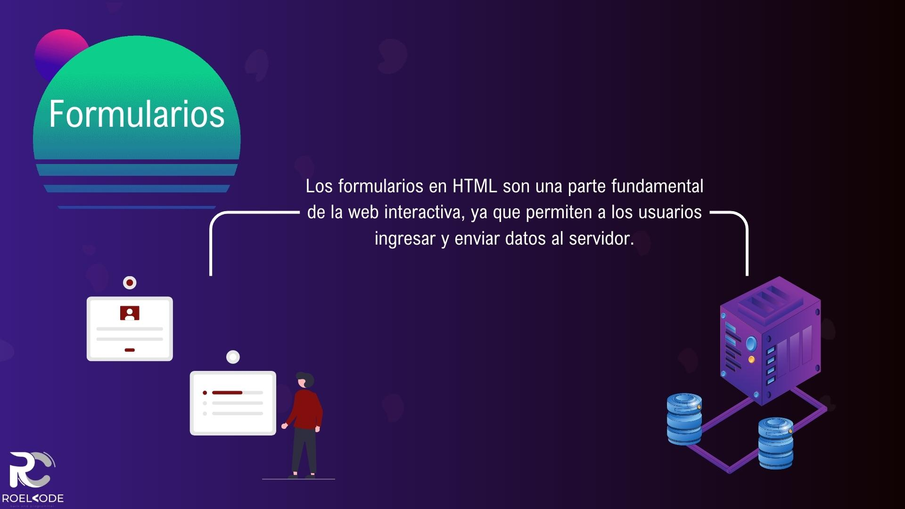
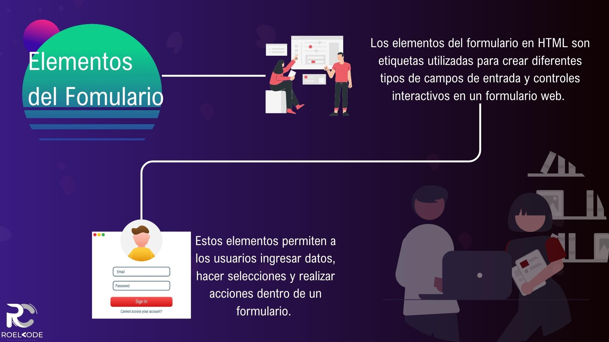

# Formularios

1. [Introducción](#introducción)
2. [Formulario](#formulario)
3. [Contenedor de elementos](#contenedor-de-elementos)
4. [Elementos del Fomulario](#elementos-del-fomulario)
5. [Elementos de entrada de datos](#elementos-de-entrada-de-datos)
6. [Validación de formulario](#validación-de-formulario)
7. [Envio y procesamiento de formulario](#envio-y-procesamiento-de-formulario)
8. [Tienda de mascotas](#tienda-de-mascotas)
9. [Resumen](#resumen)

---

## Introducción

¡Bienvenidos a la sección de Formularios en nuestro curso de HTML!

En esta sección, exploramos cómo crear formularios interactivos en HTML y aprendimos sobre los elementos clave que los componen. Los formularios son una parte fundamental de cualquier sitio web, ya que nos permiten recopilar información de los usuarios y facilitar la interacción.

A lo largo de esta sección, aprendimos sobre los elementos del formulario, como `<form>`, `<input>`, `<textarea>`, `<select>`, y más. Descubrimos cómo utilizar cada uno de estos elementos para crear campos de entrada de datos, como cajas de texto, botones de opción, listas desplegables y áreas de texto.

Además, exploramos la validación de formularios, una técnica para asegurarnos de que los datos ingresados ​​por los usuarios sean correctos y cumplan con los requisitos que hemos establecido. Aprendimos a usar atributos como required, patterny maxlengthpara validar y controlar la entrada de datos.

Una vez que los usuarios completaron el formulario, abordaron el envío y procesamiento de formularios. Aprendimos a enviar los datos ingresados ​​por el usuario a un servidor para su procesamiento posterior. Exploramos el uso del atributo actiony el método POSTo GETpara enviar y recibir datos.

Por último, nos centramos en mejorar la experiencia de usuario en formularios. Aprendimos a utilizar atributos como placeholder, autocompletey autofocuspara proporcionar sugerencias, autocompletar campos y enfocar automáticamente ciertos elementos del formulario, lo que facilita la interacción del usuario.

En resumen, en esta sección del curso de HTML sobre formularios, aprendimos a crear y gestionar formularios interactivos en nuestras páginas web. Obtuvimos habilidades prácticas para recopilar datos de los usuarios, validar la entrada y mejorar la experiencia de usuario en general.

¡Espero que hayan disfrutado esta sección y que estén listos para aplicar sus conocimientos en el desarrollo de formularios impactantes y funcionales en sus proyectos web!

---

## Formulario

Los formularios en HTML son una parte fundamental de la web interactiva, ya que permiten a los usuarios ingresar y enviar datos al servidor. Un formulario está compuesto por varios elementos, como campos de entrada, botones de envío y elementos de selección, que permiten a los usuarios proporcionar información de manera estructurada.

La estructura básica de un formulario en HTML se define utilizando la etiqueta `<form>`. Dentro de esta etiqueta se encuentran los elementos que componen el formulario. Algunos de los elementos más comunes utilizados en los formularios son:

Etiqueta `<input>`: Se utiliza para crear campos de entrada de datos, como cajas de texto, casillas de verificación y botones de radio. El atributo type especifica el tipo de campo que se va a utilizar.

Etiqueta `<textarea>`: Se utiliza para crear áreas de texto multilínea, donde los usuarios pueden ingresar texto largo o comentarios.

Etiqueta `<select>`: Se utiliza para crear menús desplegables, donde los usuarios pueden seleccionar una opción de una lista. Las opciones se definen con la etiqueta `<option>`.

Etiqueta `<button>`: Se utiliza para crear botones en el formulario, como botones de envío o botones de restablecimiento.

Etiqueta `<label>`: Se utiliza para asociar una etiqueta descriptiva con un campo de entrada. Mejora la accesibilidad y usabilidad del formulario.

Además de estos elementos, los formularios también pueden incluir otras etiquetas como `<input>` con el atributo type="file" para permitir a los usuarios seleccionar archivos para cargar.

Cuando un usuario envía un formulario, los datos ingresados se envían al servidor para su procesamiento. Esto se logra utilizando la etiqueta `<form>` con el atributo action que especifica la URL del servidor y el atributo method que indica el método HTTP utilizado para enviar los datos (por ejemplo, GET o POST).

~~~html
<h1>Formulario de contacto</h1>
    <form method="POST">
        <input type="text" id="nombre" name="nombre">

        <label for="apellido">Apellido:</label>
        <input type="text" id="apellido" name="apellido">

        <textarea id="mensaje" name="mensaje"></textarea>

        <button type="submit">Enviar</button>
    </form>
~~~

En resumen, los formularios en HTML brindan una manera interactiva y estructurada para que los usuarios ingresen y envíen datos a través de la web. Son una herramienta poderosa para la interacción usuario-sitio y se utilizan ampliamente en aplicaciones web y sitios de comercio electrónico.

## Contenedor de elementos

Las etiquetas `<fieldset>` y `<legend>` se utilizan en HTML para agrupar elementos relacionados dentro de un formulario y proporcionar una descripción o título descriptivo para ese grupo de elementos.

La etiqueta `<fieldset>` se utiliza como un contenedor para agrupar elementos relacionados en un formulario. Proporciona una forma visual de organizar y estructurar los campos del formulario. Puede contener múltiples elementos, como campos de entrada, casillas de verificación, botones, etc. Al utilizar `<fieldset>`, se crea un borde alrededor del grupo de elementos relacionados.

La etiqueta `<legend>` se utiliza dentro de `<fieldset>` y se coloca antes de los elementos agrupados. Sirve para proporcionar una descripción o título descriptivo para ese grupo de elementos. El texto especificado dentro de `<legend>` se muestra generalmente en negrita y se coloca en la parte superior o en la esquina del grupo de elementos.

Aquí tienes un ejemplo de cómo se pueden utilizar estas etiquetas en un formulario:

~~~html
<form>
  <fieldset>
    <legend>Información personal</legend>
    <label for="nombre">Nombre:</label>
    <input type="text" id="nombre" name="nombre" >
     
    <label for="apellido">Apellido:</label>
    <input type="text" id="apellido" name="apellido" >
  </fieldset>

  <fieldset>
    <legend>Preferencias</legend>
    <label for="color">Color favorito:</label>
    <input type="color" id="color" name="color">
     
    <label for="animal">Animal favorito:</label>
    <select id="animal" name="animal">
      <option value="perro">Perro</option>
      <option value="gato">Gato</option>
      <option value="pajaro">Pájaro</option>
    </select>
  </fieldset>

  <input type="submit" value="Enviar">
</form>

~~~

En este ejemplo, se utilizan `<fieldset>` para agrupar los campos relacionados de "Información personal" y "Preferencias". `<legend>` se utiliza para proporcionar un título descriptivo para cada grupo.

El uso de `<fieldset>` y `<legend>` ayuda a mejorar la estructura y legibilidad de los formularios, así como a proporcionar una mejor comprensión de la relación entre los campos relacionados.

---

## Elementos del Fomulario

Los elementos del formulario en HTML son etiquetas utilizadas para crear diferentes tipos de campos de entrada y controles interactivos en un formulario web. Estos elementos permiten a los usuarios ingresar datos, hacer selecciones y realizar acciones dentro de un formulario. Algunos de los elementos más comunes son:

* `<input>`: Se utiliza para crear campos de entrada de datos en un formulario, como texto, número, fecha, checkbox, radio, etc.

Ejemplo:

~~~html
<label for="nombre">Nombre:</label>
<input type="text" id="nombre" name="nombre" placeholder="Ingrese su nombre" required>
~~~

* `<label>`: Se utiliza para asociar un texto descriptivo a un elemento del formulario, como un campo de entrada. También puede mejorar la accesibilidad.

Ejemplo:

~~~html
<label for="nombre">Nombre:</label>
<input type="text" id="nombre" name="nombre" required>
~~~

* `<select>`: Se utiliza para crear una lista desplegable de opciones donde el usuario puede seleccionar una o varias opciones.

Ejemplo:

~~~html
<label for="frutas">Frutas:</label>
<select id="frutas" name="frutas" multiple>
  <option value="manzana">Manzana</option>
  <option value="banana">Banana</option>
  <option value="naranja">Naranja</option>
</select>
~~~

* `<textarea>`: Se utiliza para crear un campo de texto multilínea donde el usuario puede ingresar texto de forma extensa.

Ejemplo:

~~~html
<label for="comentario">Comentario:</label>
<textarea id="comentario" name="comentario" rows="4" cols="50"></textarea>
~~~

`<button>`: Se utiliza para crear un botón en un formulario que puede ser utilizado para enviar el formulario o ejecutar alguna acción definida mediante JavaScript.

Ejemplo:

~~~html
<button type="submit">Enviar</button>
~~~

* `<fieldset>`: Se utiliza para agrupar elementos relacionados en un formulario y crear una sección con un borde y un título opcional.

Ejemplo:

~~~html
<fieldset>
  <legend>Información Personal</legend>
  <label for="nombre">Nombre:</label>
  <input type="text" id="nombre" name="nombre">
  <!-- Otros campos de entrada -->
</fieldset>
~~~

* `<legend>`: Se utiliza como título para un `<fieldset>`, proporcionando una descripción o etiqueta para el grupo de elementos relacionados.

Ejemplo:

~~~html
<fieldset>
  <legend>Información Personal</legend>
  <label for="nombre">Nombre:</label>
  <input type="text" id="nombre" name="nombre">
  <!-- Otros campos de entrada -->
</fieldset>
~~~

* `<datalist>`: Se utiliza para proporcionar una lista de opciones predefinidas para un campo de entrada `<input>`, que se mostrarán como sugerencias al usuario.

Ejemplo:

~~~html
<label for="fruta">Fruta:</label>
<input type="text" id="fruta" name="fruta" list="frutas">
<datalist id="frutas">
  <option value="Manzana">
  <option value="Banana">
  <option value="Naranja">
</datalist>
~~~

* `<output>`: Se utiliza para mostrar los resultados de un cálculo o procesamiento realizado en el formulario.

Ejemplo:

~~~html
<label for="num1">Número 1:</label>
<input type="number" id="num1" name="num1">
<label for="num2">Número 2:</label>
<input type="number" id="num2" name="num2">
<output id="resultado"></output>
<button onclick="calcular()">Calcular</button>

~~~

* `<option>`: Se utiliza dentro de un elemento `<select>` para definir una opción seleccionable en la lista desplegable.

Ejemplo:

~~~html
<select>
  <option value="opcion1">Opción 1</option>
  <option value="opcion2">Opción 2</option>
  <option value="opcion3">Opción 3</option>
</select>
~~~

* `<optgroup>`: Se utiliza dentro de un elemento `<select>` para agrupar opciones relacionadas en una categoría.

Ejemplo:

~~~html
<select>
  <optgroup label="Frutas">
    <option value="manzana">Manzana</option>
    <option value="banana">Banana</option>
  </optgroup>
  <optgroup label="Colores">
    <option value="rojo">Rojo</option>
    <option value="azul">Azul</option>
  </optgroup>
</select>
~~~

Estos son solo algunos ejemplos de uso de las etiquetas mencionadas. Recuerda que hay muchas más etiquetas y atributos disponibles en HTML, y puedes combinarlos y personalizarlos según tus necesidades específicas.

---

## Elementos de entrada de datos

En HTML, los formularios utilizan elementos de entrada de datos para permitir a los usuarios ingresar y enviar información al servidor. Aquí tienes información sobre los elementos de entrada de datos más comunes en formularios HTML:

* `<input type="button">`: Crea un botón sin funcionalidad predefinida, que se puede utilizar para ejecutar acciones personalizadas mediante JavaScript.

Ejemplo:

~~~html
<input type="button" value="Haz clic" onclick="alert('Hola mundo!')">
~~~

* `<input type="checkbox">`: Crea una casilla de verificación que permite al usuario seleccionar una o varias opciones.

Ejemplo:

~~~html
<input type="checkbox" id="opcion1" name="opcion1" value="opcion1">
<label for="opcion1">Opción 1</label>
~~~

* `<input type="color">`: Crea un campo de entrada que permite al usuario seleccionar un color.

Ejemplo:

~~~html
<input type="color" id="color" name="color">
~~~

* `<input type="date">`: Crea un campo de entrada que permite al usuario seleccionar una fecha.

Ejemplo:

~~~html
<input type="date" id="fecha" name="fecha">
~~~

* `<input type="datetime-local">`: Crea un campo de entrada que permite al usuario seleccionar una fecha y hora local.

Ejemplo:

~~~html
<input type="datetime-local" id="fechaHora" name="fechaHora">
~~~

* `<input type="email">`: Crea un campo de entrada que valida si el valor ingresado es una dirección de correo electrónico válida.

Ejemplo:

~~~html
<input type="email" id="correo" name="correo" placeholder="Correo electrónico">
~~~

* `<input type="file">`: Crea un campo de entrada que permite al usuario seleccionar un archivo para cargarlo.

Ejemplo:

~~~html
<input type="file" id="archivo" name="archivo">
~~~

* `<input type="hidden">`: Crea un campo de entrada oculto que no es visible para el usuario, pero cuyo valor se envía cuando se envía el formulario.

Ejemplo:

~~~html
<input type="hidden" name="secreto" value="valor_secreto">
~~~

* `<input type="image">`: Crea un botón de imagen que actúa como un botón de envío de formulario y muestra una imagen como su representación visual.

Ejemplo:

~~~html
<input type="image" src="imagen.png" alt="Enviar">
~~~

* `<input type="month">`: Crea un campo de entrada que permite al usuario seleccionar un mes y un año.

Ejemplo:

~~~html
<input type="month" id="mes" name="mes">
~~~

* `<input type="number">`: Crea un campo de entrada que permite al usuario ingresar un valor numérico.

Ejemplo:

~~~html
<input type="number" id="cantidad" name="cantidad" min="1" max="10">
~~~

* `<input type="password">`: Crea un campo de entrada que oculta los caracteres ingresados y se utiliza para ingresar contraseñas u otra información confidencial.

Ejemplo:

~~~html
<input type="password" id="contrasena" name="contrasena" placeholder="Contraseña">
~~~

* `<input type="radio">`: Crea un botón de opción que permite al usuario seleccionar una opción entre varias.

Ejemplo:

~~~html
<input type="radio" id="opcion1" name="opcion" value="opcion1">
<label for="opcion1">Opción 1</label>
<input type="radio" id="opcion2" name="opcion" value="opcion2">
<label for="opcion2">Opción 2</label>
~~~

* `<input type="range">`: Crea un control deslizante que permite al usuario seleccionar un valor dentro de un rango específico.

Ejemplo:

~~~html
<input type="range" id="valor" name="valor" min="0" max="100">
~~~

* `<input type="reset">`: Crea un botón de reinicio que restablece los valores del formulario a sus valores predeterminados.

Ejemplo:

~~~html
<input type="reset" value="Reiniciar">
~~~

* `<input type="search">`: Crea un campo de búsqueda que se utiliza para ingresar términos de búsqueda.

Ejemplo:

~~~html
<input type="search" id="buscar" name="buscar" placeholder="Buscar...">
~~~

* `<input type="submit">`: Crea un botón de envío de formulario que se utiliza para enviar el formulario al servidor.

Ejemplo:

~~~html
<input type="submit" value="Enviar">
~~~

* `<input type="tel">`: Crea un campo de entrada que se utiliza para ingresar números de teléfono.

Ejemplo:

~~~html
<input type="tel" id="telefono" name="telefono" placeholder="Teléfono">
~~~

* `<input type="text">`: Crea un campo de entrada que se utiliza para ingresar texto.

Ejemplo:

~~~html
<input type="text" id="nombre" name="nombre" placeholder="Nombre">
~~~

* `<input type="time">`: Crea un campo de entrada que permite al usuario seleccionar una hora.

Ejemplo:

~~~html
<input type="time" id="hora" name="hora">
~~~

* `<input type="url">`: Crea un campo de entrada que valida si el valor ingresado es una URL válida.

Ejemplo:

~~~html
<input type="url" id="sitioWeb" name="sitioWeb" placeholder="Sitio web">
~~~

* `<input type="week">`: Crea un campo de entrada que permite al usuario seleccionar una semana y un año.

Ejemplo:

~~~html
<input type="week" id="semana" name="semana">
~~~

Recuerda que estos son solo ejemplos básicos de uso de las etiquetas `<input>`. Puedes combinarlos con otros atributos y personalizarlos según tus necesidades específicas.

Recuerda que los datos ingresados por los usuarios en estos elementos de entrada deben ser validados y procesados en el lado del servidor para garantizar la seguridad y la integridad de los datos antes de su almacenamiento o uso adicional.

---

## Validación de formulario

La validación de formularios en HTML es importante para asegurarse de que los datos ingresados por los usuarios cumplan con ciertos criterios o restricciones antes de ser enviados al servidor. A continuación, te presento algunas técnicas y atributos que puedes utilizar para realizar la validación de formularios en HTML:

* Validación HTML5:

  HTML5 introduce varios atributos de validación que puedes utilizar en los elementos de entrada de datos. Algunos ejemplos son:
  * `required:` Este atributo indica que el campo de entrada es obligatorio y no puede estar vacío.
  * `pattern:` Este atributo permite especificar una expresión regular que el valor del campo de entrada debe cumplir.
  * `maxlength y minlength`: Estos atributos permiten establecer la longitud máxima y mínima permitida para el valor del campo de entrada.
  * `type="email" y type="url"`: Estos atributos de tipo específico validan que el valor del campo de entrada sea una dirección de correo electrónico válida o una URL válida, respectivamente.

* Validación de JavaScript:
  Además de la validación HTML5, puedes utilizar JavaScript para realizar una validación más avanzada y personalizada. Puedes utilizar el evento onsubmit del formulario para llamar a una función JavaScript que realice la validación. Dentro de esta función, puedes realizar comprobaciones adicionales utilizando expresiones regulares, comparaciones, validaciones personalizadas, entre otros.
Por ejemplo, aquí tienes un ejemplo básico de una función de validación en JavaScript que verifica si el campo de entrada no está vacío:

~~~html

<form onsubmit="return validarFormulario()">
  <input type="text" id="nombre" required>
  <input type="submit" value="Enviar">
</form>

~~~

* Mensajes de validación personalizados:
  Puedes personalizar los mensajes de validación que se muestran a los usuarios cuando la validación falla utilizando el atributo pattern, required y otros atributos de validación. Puedes utilizar el atributo title para proporcionar mensajes más descriptivos.

Por ejemplo:

~~~html
<input type="email" id="email" required pattern="[a-z0-9._%+-]+@[a-z0-9.-]+\.[a-z]{2,}$" title="Ingrese una dirección de correo electrónico válida">
~~~

El código HTML que has proporcionado corresponde a un campo de entrada de tipo "email" en un formulario. Este campo está diseñado para capturar direcciones de correo electrónico y tiene algunas características adicionales de validación.

A continuación, se explica cada parte del código:

* **type="email":** Especifica que el campo de entrada es de tipo "email", lo que significa que espera una dirección de correo electrónico válida como entrada.

* **id="email":** Proporciona un identificador único para el campo de entrada. Esto permite que otros elementos o scripts se refieran a este campo de manera única.

* **required:** Es un atributo booleano que indica que este campo es obligatorio y debe ser completado antes de enviar el formulario. Si el campo está vacío, el navegador mostrará un mensaje de validación predeterminado y no permitirá enviar el formulario.

* **pattern="`[a-z0-9._%+-]`+@`[a-z0-9.-]+\.[a-z]`{2,}$":** Especifica una expresión regular que define el patrón que debe seguir la dirección de correo electrónico ingresada en el campo. La expresión regular valida que la dirección de correo electrónico tenga un formato específico. En este caso, la expresión regular indica lo siguiente:

  * `[a-z0-9._%+-]`+: Permite letras minúsculas, dígitos, puntos, guiones, signos de porcentaje y signos más o menos antes del símbolo "@".

  * @: Se espera que haya un símbolo "@" después de la combinación anterior.

  * `[a-z0-9.-]`+: Permite letras minúsculas, dígitos, puntos y guiones antes del símbolo "." (punto).

  * `\.`: Escapa el símbolo "." para que sea interpretado literalmente.

  * `[a-z]`{2,}: Permite al menos dos letras minúsculas después del símbolo ".".

Estos son solo algunos ejemplos de cómo realizar la validación de formularios en HTML. Recuerda que la validación en el lado del cliente (HTML y JavaScript) es útil para mejorar la experiencia del usuario, pero siempre debes realizar una validación adicional en el lado del servidor para garantizar la seguridad y la integridad de los datos.

---

## Envio y procesamiento de formulario

En HTML, el envío y procesamiento de formularios se realiza mediante el uso de la etiqueta `<form>` y los atributos asociados. Aquí tienes una guía básica sobre cómo enviar y procesar formularios en HTML:

* Etiqueta `<form>`:
  La etiqueta `<form>` se utiliza para envolver todos los elementos del formulario y establecer las propiedades de envío. Aquí tienes un ejemplo básico de cómo se utiliza:

~~~html
<form action="procesar.php" method="post">
  <!-- Aquí van los elementos del formulario -->
  <input type="text" name="nombre">
  <input type="submit" value="Enviar">
</form>
~~~

* El atributo action especifica la URL o el archivo de script en el servidor al que se enviarán los datos del formulario para su procesamiento.

* El atributo method especifica el método de envío de los datos. Los dos métodos más comunes son GET y POST.

* Método `GET`:
  Con el método "GET", los datos del formulario se envían como parte de la URL. Esto significa que los datos son visibles en la barra de direcciones del navegador y pueden ser guardados en el historial de navegación. El método "GET" se utiliza principalmente para solicitar información del servidor. Es útil para formularios de búsqueda o cuando se desea compartir fácilmente los parámetros de la URL. Sin embargo, debido a que los datos se incluyen en la URL, existe una limitación en la cantidad de datos que se pueden enviar y también puede haber problemas de seguridad si se envían datos sensibles.

  ~~~html
  <form action="procesar.php" method="get">
    <input type="text" name="nombre">
    <input type="submit" value="Enviar">
  </form>
  ~~~

  * En este caso, los datos del formulario se enviarán a procesar.php como `procesar.php?nombre=valor`.

* Método `POST`:
  Por otro lado, con el método "POST", los datos del formulario se envían en el cuerpo de la solicitud HTTP. Los datos no son visibles en la URL y no se guardan en el historial de navegación. El método "POST" se utiliza principalmente para enviar información al servidor para su procesamiento. Es adecuado para enviar datos sensibles, como contraseñas o información personal. A diferencia del método "GET", no hay limitaciones en la cantidad de datos que se pueden enviar utilizando "POST". Además, el envío de datos a través de "POST" brinda una capa adicional de seguridad, ya que los datos no son visibles en la URL.

  ~~~html
  <form action="procesar.php" method="post">
    <input type="text" name="nombre">
    <input type="submit" value="Enviar">
  </form>
  ~~~

  * En este caso, los datos del formulario se enviarán al archivo procesar.php en el cuerpo de la solicitu  d.
  
* Procesamiento del formulario:
  Para procesar los datos del formulario, necesitarás un archivo de script en el lado del servidor (como PHP, Python, Node.js, etc.) que reciba los datos y realice las acciones necesarias.

Es importante realizar una validación adecuada y asegurarse de que los datos enviados por los usuarios sean seguros antes de procesarlos o almacenarlos. Además, ten en cuenta que los archivos de script en el lado del servidor deben estar correctamente configurados y accesibles para que el formulario se envíe y procese correctamente.

En resumen, la principal diferencia entre "GET" y "POST" en HTML es que "GET" envía los datos como parte de la URL, mientras que "POST" los envía en el cuerpo de la solicitud HTTP. La elección entre los dos métodos depende de la naturaleza de los datos y de si se trata de información sensible o no.

---

## Tienda de mascotas

~~~html
<!DOCTYPE html>
<html lang="es">
<head>
  <meta charset="UTF-8">
  <meta name="viewport" content="width=device-width, initial-scale=1.0">
  <title>Formulario de Solicitud de Empleo</title>
</head>
<body>
    <h1>Mundo Animalito</h1>
    
Estamos emocionados de ayudarte a mantener a tu mascota feliz y saludable con nuestros alimentos de calidad. Completa el formulario a continuación y estaremos encantados de atender tu pedido.

    <form action="">
        <fieldset>
          <legend>Tus Datos</legend>
          <label for="nombre">Nombre:</label>
          <input type="text" id="nombre" name="nombre" required>
      
          <label for="apellido">Apellido:</label>
          <input type="text" id="apellido" name="apellido" required>
      
            
      
          <label for="correo">Correo:</label>
          <input type="email" id="correo" name="correo" required placeholder="Correo electrónico">
      
          <label for="contraseña">Contraseña:</label>
          <input type="password" id="contraseña" name="contraseña" required placeholder="Contraseña">
        </fieldset>
      
        <fieldset>
          <legend>Datos de tu Mascota</legend>
          <label for="nombreMascota">Nombre de la mascota:</label>
          <input type="text" id="nombreMascota" name="nombreMascota" required>
      
          <label for="color">Color de pelo de la mascota:</label>
          <input type="color" id="color" name="color">
      
          <label for="animal">Animal:</label>
          <select id="animal" name="animal">
            <option value="perro">Perro</option>
            <option value="gato">Gato</option>
            <option value="pajaro">Pájaro</option>
          </select>
      
          <label for="genero">Género:</label>
          <select name="genero" id="genero">
            <option value="macho">Macho</option>
            <option value="hembra">Hembra</option>
          </select>
      
           
          <label for="descripcion">Descripción:</label>
           
          <textarea name="descripcion" id="descripcion" cols="70" rows="3" placeholder="Tu mascota padece alguna enfermedad o sufre de efectos secundarios, etc."></textarea>
        </fieldset>
      
        <fieldset>
          <legend>Compra de Alimentos</legend>
          <label for="alimento">Alimento:</label>
          <input type="text" id="alimento" name="alimento" required>
      
          <label for="cantidad">Cantidad:</label>
          <input type="number" id="cantidad" name="cantidad" required min="1">
      
          <label for="direccion">Dirección de entrega:</label>
          <input type="text" id="direccion" name="direccion" required>
      
          <label for="metodoPago">Método de Pago:</label>
          <select id="metodoPago" name="metodoPago">
            <option value="tarjeta">Tarjeta de Crédito</option>
            <option value="efectivo">Efectivo</option>
            <option value="paypal">PayPal</option>
          </select>
        </fieldset>
      
        <input type="submit" value="Enviar">
      </form>

      

        ¡Gracias por elegir Mundo Animalito para satisfacer las necesidades alimenticias de tu mascota!
      

      
</body>
</html>

~~~

---

## Resumen

En conclusión, en esta sección del curso de HTML sobre formularios, hemos explorado de manera exhaustiva los elementos esenciales para crear formularios interactivos y funcionales. Hemos aprendido cómo utilizar etiquetas como `<form>`, `<input>`, `<textarea>` y `<select>` para recopilar y procesar datos ingresados ​​por los usuarios.

Además, hemos determinado la importancia de la validación de formularios para asegurarnos de que los datos ingresados ​​cumplen con los requisitos establecidos. Hemos utilizado atributos como required, patterny maxlengthpara garantizar la integridad de los datos y mejorar la experiencia del usuario.

También hemos explorado el envío y procesamiento de formularios, comprendiendo cómo los datos ingresados ​​pueden ser enviados a un servidor para su posterior manipulación. Hemos utilizado el atributo actiony los métodos POSTo GETpara lograr este proceso de manera efectiva.

Por último, nos hemos enfocado en mejorar la experiencia de usuario en formularios, aprovechando atributos como placeholder, autocompletey autofocuspara brindar sugerencias, facilitar el llenado de formularios y enfocar automáticamente ciertos campos.

En resumen, los formularios son elementos fundamentales en el desarrollo web y esta sección del curso nos ha brindado las habilidades necesarias para diseñar y crear formularios interactivos y eficientes. A través del uso adecuado de etiquetas, características y técnicas de validación, podemos garantizar la recopilación de datos precisos y mejorar la experiencia del usuario en general.

Espero que esta sección del curso haya sido útil y te sientas preparado/a para aplicar estos conocimientos en tus proyectos web. ¡Sigue practicando y explorando nuevas formas de mejorar tus formularios para brindar una experiencia excepcional a los usuarios!
