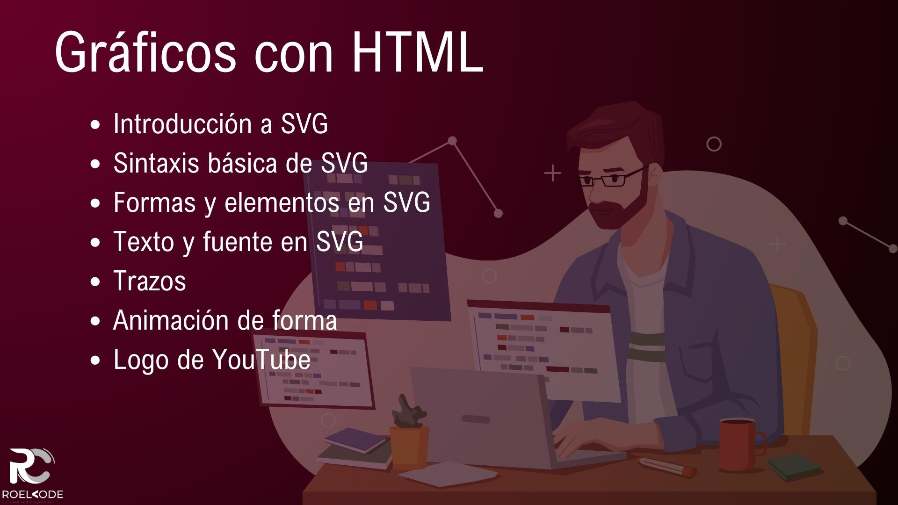
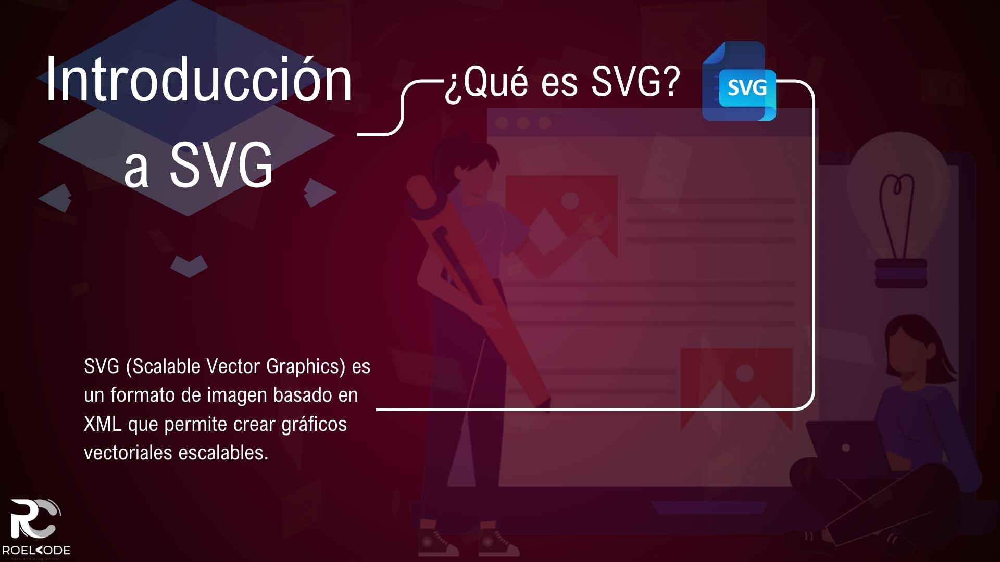
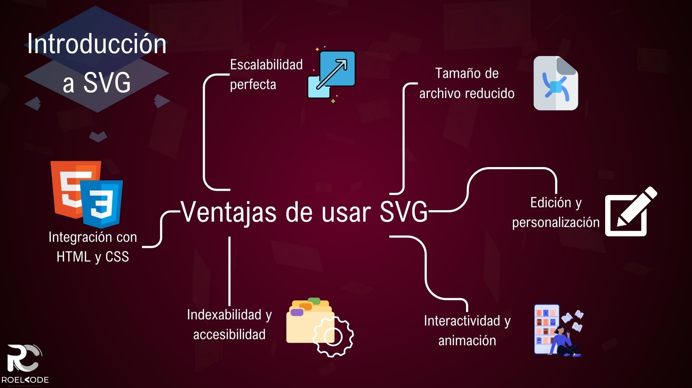
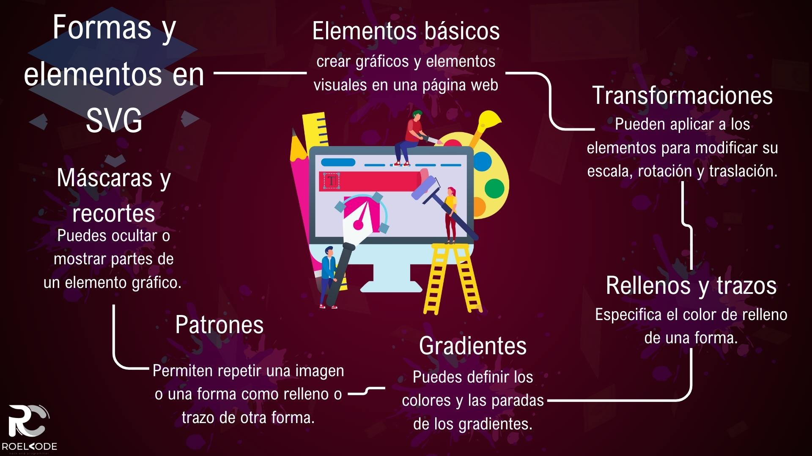

# Gráficos con HTML

1. [Introducción](#introducción)
2. [Introducción a SVG](#introducción-a-svg)
3. [Sintaxis básica de SVG](#sintaxis-básica-de-svg)
4. [Formas y elementos en SVG](#formas-y-elementos-en-svg)
5. [Texto y fuente en SVG](#texto-y-fuente-en-svg)
6. [Trazos](#trazos)
7. [Animación de forma](#animación-de-forma)
8. [Logo de YouTube](#logo-de-youtube)
9. [Resumen](#resumen)

---

## Introducción

¡Bienvenidos a la sección de Gráficos HTML de nuestro curso de HTML! En esta sección, exploramos el fascinante mundo de los gráficos y las imágenes en HTML, centrándonos especialmente en SVG (Scalable Vector Graphics).

Comenzamos con una introducción a SVG, aprendiendo qué es SVG y por qué es una herramienta poderosa para crear gráficos vectoriales escalables en la web. Con SVG, pudimos crear imágenes y animaciones de alta calidad que se adaptan a diferentes tamaños de pantalla sin perder calidad.

Luego, nos sumergimos en la sintaxis básica de SVG. Conocimos el elemento `<svg>` y los atributos principales que utilizamos para definir el lienzo de trabajo y ajustar el tamaño de nuestras imágenes. También aprendimos sobre las coordenadas y el sistema de coordenadas en SVG, así como las unidades de medida que pudimos utilizar.

Continuamos explorando las formas y elementos disponibles en SVG. Desde crear rectángulos y círculos hasta líneas y polígonos, aprendimos cómo utilizar estas formas básicas y combinarlas para gráficos más complejos. También vimos cómo agregar texto y personalizar la fuente en nuestros gráficos SVG.

Otro aspecto importante de SVG son los trazos, que nos permiten definir el grosor, el color y otros atributos de los bordes de nuestras formas. Aprendimos a trabajar con trazos y cómo aplicar efectos como bordes punteados o bordes redondeados.

Por último, nos sumergimos en la animación de formas en SVG. Aprendimos a utilizar los atributos y las técnicas adecuadas para crear animaciones suaves y atractivas en nuestros gráficos. Desde transiciones sencillas hasta animaciones más complejas, descubrimos cómo dar vida a nuestros gráficos SVG.

A lo largo de esta sección, exploramos los conceptos clave de los gráficos HTML y SVG, acompañados de ejemplos prácticos que ayudarán a comprender y aplicar estos conocimientos. Espero que hayas disfrutado aprendiendo sobre los gráficos HTML en este curso y que te sientes inspirado para crear tus propios gráficos y animaciones en el futuro.

¡Fue un placer compartir este conocimiento contigo y espero que puedas aprovechar al máximo tus habilidades en gráficos HTML y SVG!

---

## Introducción a SVG

* **¿Qué es SVG?**
SVG (Scalable Vector Graphics) es un formato de imagen basado en XML que permite crear gráficos vectoriales escalables. A diferencia de las imágenes rasterizadas, que se basan en píxeles y se pixelan al ampliarlas, SVG utiliza ecuaciones matemáticas para representar los elementos gráficos, lo que permite que las imágenes se redimensionen sin perder calidad.

* Ventajas de usar SVG en comparación con imágenes rasterizadas:

  * **Escalabilidad perfecta:** Una de las principales ventajas de SVG es su capacidad para escalar sin pérdida de calidad. Puedes ampliar o reducir una imagen SVG a cualquier tamaño sin que se vea borrosa o pixelada, lo que lo hace ideal para diseños responsivos y dispositivos de pantalla diferentes.

  * **Tamaño de archivo reducido:** Los archivos SVG suelen ser mucho más pequeños en tamaño en comparación con imágenes rasterizadas como JPEG o PNG. Esto se debe a que SVG describe las imágenes mediante código XML, que es un formato de archivo de texto, mientras que las imágenes rasterizadas almacenan información de cada píxel.

  * **Edición y personalización:** SVG es un formato de imagen editable, lo que significa que puedes modificar y editar fácilmente los elementos gráficos con herramientas de edición de texto o gráficos vectoriales. Puedes cambiar colores, formas, tamaños y otros atributos de manera rápida y sencilla.

  * **Interactividad y animación:** SVG permite agregar interactividad y animación a las imágenes mediante la incorporación de scripts o el uso de atributos y elementos específicos de SVG. Puedes crear botones, efectos de desplazamiento, transiciones suaves y mucho más para mejorar la experiencia del usuario.

  * **Indexabilidad y accesibilidad:** A diferencia de las imágenes rasterizadas, el contenido de las imágenes SVG es legible por los motores de búsqueda y se puede indexar. Además, SVG se puede hacer accesible mediante el uso adecuado de etiquetas y atributos para describir el contenido visual a las tecnologías de asistencia.

  * **Integración con HTML y CSS:** SVG se puede integrar fácilmente en documentos HTML mediante la etiqueta `<svg>`. Además, puedes aplicar estilos CSS a los elementos SVG para personalizar la apariencia y el diseño de tus gráficos.

En resumen, SVG es un formato de imagen versátil que ofrece ventajas significativas sobre las imágenes rasterizadas. Su capacidad para escalar sin pérdida de calidad, su tamaño de archivo reducido, su editabilidad, interactividad y accesibilidad lo convierten en una opción poderosa para crear gráficos vectoriales en la web.

---

## Sintaxis básica de SVG

* **Elemento `<svg>` y atributos principales:**
El elemento `<svg>` es el contenedor principal utilizado para definir un gráfico SVG en un documento HTML. Algunos de los atributos principales que se pueden utilizar con el elemento `<svg>` son:
  * **width y height:** especifican las dimensiones del gráfico SVG.
  * **viewBox:** define el área visible del gráfico y cómo se escala y recorta.
  * **xmlns:** establece el espacio de nombres XML para SVG.
  * **xmlns:xlink:** se utiliza para enlazar recursos externos.
Ejemplo:

~~~html
<svg width="200" height="200" viewBox="0 0 200 200" xmlns="http://www.w3.org/2000/svg">
  <!-- contenido del gráfico SVG -->
</svg>
~~~

* **Coordenadas y sistema de coordenadas en SVG:**
SVG utiliza un sistema de coordenadas en el que el punto de origen (0, 0) se encuentra en la esquina superior izquierda del área de visualización. Los valores positivos de X aumentan hacia la derecha y los valores positivos de Y aumentan hacia abajo.
Ejemplo:

~~~html
<svg width="200" height="200" xmlns="http://www.w3.org/2000/svg">
  <circle cx="100" cy="100" r="50" fill="red" />
</svg>
~~~

* **Unidades de medida en SVG:**
SVG admite diferentes unidades de medida para especificar dimensiones y posiciones. Algunas unidades comunes son:
  * **px (píxeles):** la unidad por defecto, un píxel en la pantalla.
  * **em (em):** relativo al tamaño de la fuente actual.
  * **% (porcentaje):** relativo al tamaño del contenedor.
  * **pt (puntos):** 1/72 de una pulgada.
  * **cm** (centímetros), **mm** (milímetros), **in** (pulgadas), entre otros.
Ejemplo:

~~~html
<svg width="10cm" height="5cm" xmlns="http://www.w3.org/2000/svg">
  <rect x="1cm" y="1cm" width="8cm" height="3cm" fill="blue" />
</svg>
~~~

En resumen, la sintaxis básica de SVG incluye el elemento `<svg>` como contenedor principal, atributos como `width`, `height` y `viewBox`, el sistema de coordenadas con el punto de origen en la esquina superior izquierda y diferentes unidades de medida para especificar dimensiones y posiciones. Estos conceptos son fundamentales para trabajar con SVG y crear gráficos vectoriales en HTML.

---

## Formas y elementos en SVG

* **Elementos básicos:** SVG proporciona una amplia variedad de formas y elementos que se pueden utilizar para crear gráficos y elementos visuales en una página web. Algunas de las formas y elementos más comunes en SVG incluyen:

  * `<rect>`: Se utiliza para crear un rectángulo. Puedes especificar sus coordenadas (x, y) de inicio, ancho, altura, esquinas redondeadas y otros atributos.

  Ejemplo:

  ~~~html
  <svg>
    <rect x="50" y="50" width="200" height="100" fill="blue" />
  </svg>
  ~~~

  * `<circle>`: Crea un círculo con un centro (cx, cy) y un radio (r). Puedes especificar atributos como el color de relleno, color de trazo, etc.

  Ejemplo:

  ~~~html
  <svg>
    <circle cx="150" cy="150" r="50" fill="red" />
  </svg>
  ~~~

  * `<ellipse>`: Similar al círculo, pero permite especificar diferentes radios para los ejes X e Y, creando así una elipse.

  Ejemplo:

  ~~~html
  <svg>
    <ellipse cx="150" cy="150" rx="80" ry="50" fill="green" />
  </svg>
  ~~~

  * `<line>`: Crea una línea recta entre dos puntos. Puedes especificar las coordenadas de inicio y finalización, así como atributos como el grosor del trazo y el color.

  Ejemplo:

  ~~~html
  <svg>
    <line x1="50" y1="50" x2="200" y2="200" stroke="black" />
  </svg>
  ~~~

  * `<polyline>`: Crea una serie de segmentos de línea conectados. Puedes especificar una lista de puntos mediante las coordenadas (x, y) y atributos como el color de trazo.

  Ejemplo:

  ~~~html
  <svg>
    <polyline points="50,50 100,100 150,50 200,100" fill="none" stroke="blue" />
  </svg>
  ~~~

  * `<polygon>`: Similar a `<polyline>`, pero crea un polígono cerrado conectando el último punto con el primero.

  Ejemplo:

  ~~~html
  <svg>
    <polygon points="50,50 100,100 150,50" fill="yellow" stroke="black" />
  </svg>
  ~~~

* **Transformaciones:**
SVG proporciona transformaciones que se pueden aplicar a los elementos para modificar su escala, rotación y traslación.

  * Escala (`<scale>`): Escala un elemento en los ejes X e Y.
  Ejemplo:

  ~~~html
  <svg>
    <rect x="50" y="50" width="100" height="50" transform="scale(2, 1.5)" fill="red" />
  </svg>
  ~~~

  * Rotación (`<rotate>`): Rota un elemento alrededor de un punto de origen.
  Ejemplo:

  ~~~html
  <svg>
    <rect x="50" y="50" width="100" height="50" transform="rotate(45, 100, 75)" fill="blue" />
  </svg>
  ~~~

  * Traslación (`<translate>`): Mueve un elemento en los ejes X e Y.
  Ejemplo:

  ~~~html
  <svg>
    <rect x="50" y="50" width="100" height="50" transform="translate(50, 50)" fill="green" />
  </svg>
  ~~~

* **Rellenos y trazos:**

  * Color de relleno (fill): Especifica el color de relleno de una forma.
  Ejemplo:

  ~~~html
  <svg>
    <rect x="50" y="50" width="100" height="50" fill="red" />
  </svg>
  ~~~

  * **Gradientes:** SVG admite gradientes lineales y radiales que se pueden utilizar como relleno o trazo de una forma. Puedes definir los colores y las paradas de los gradientes.
  
  Ejemplo de gradiente lineal:

  ~~~html
  <svg>
    <defs>
      <linearGradient id="grad" x1="0%" y1="0%" x2="100%" y2="0%">
        <stop offset="0%" style="stop-color: red" />
        <stop offset="100%" style="stop-color: blue" />
      </linearGradient>
    </defs>
    <rect x="50" y="50" width="200" height="100" fill="url(#grad)" />
  </svg>
  ~~~

  * **Patrones:** Los patrones en SVG permiten repetir una imagen o una forma como relleno o trazo de otra forma.

  Ejemplo de patrón:

  ~~~html
  <svg>
    <defs>
      <pattern id="pat" x="0" y="0" width="20" height="20" patternUnits="userSpaceOnUse">
        <rect x="0" y="0" width="20" height="20" fill="red" />
        <circle cx="10" cy="10" r="5" fill="blue" />
      </pattern>
    </defs>
    <rect x="50" y="50" width="200" height="100" fill="url(#pat)" />
  </svg>
  ~~~

* **Máscaras y recortes:** Las máscaras y los recortes son técnicas que se utilizan en SVG para ocultar o mostrar partes de un elemento gráfico. 

  * Máscaras (`<mask>`): Permiten ocultar o mostrar áreas de un elemento mediante una máscara definida.

  Ejemplo:

  ~~~html
  <svg>
    <defs>
      <mask id="mask">
        <rect x="0" y="0" width="200" height="200" fill="white" />
        <circle cx="100" cy="100" r="50" fill="black" />
      </mask>
    </defs>
    <rect x="50" y="50" width="200" height="200" fill="red" mask="url(#mask)" />
  </svg>
  ~~~

  * Recortes (`<clipPath>`): Define un área recortada para mostrar solo una parte de un elemento.

  Ejemplo:

  ~~~html
  <svg>
    <defs>
      <clipPath id="clip">
        <rect x="0" y="0" width="100" height="100" />
      </clipPath>
    </defs>
    <circle cx="150" cy="150" r="50" fill="blue" clip-path="url(#clip)" />
  </svg>
  ~~~

Estos son algunos de los elementos y conceptos básicos en SVG. Puedes combinarlos y experimentar con diferentes atributos y propiedades para crear gráficos y animaciones más complejas en SVG.

---

## Texto y fuente en SVG

* **Elemento `<text>` y atributos de formato de texto:**
  El elemento `<text>` se utiliza para agregar texto a un gráfico SVG. Algunos de los atributos de formato de texto más comunes son:

  * `x y y:` especifican las coordenadas de inicio del texto.
  * `font-family:` define la fuente utilizada para el texto.
  * `font-size:` establece el tamaño de la fuente.
  * `font-weight:` controla el grosor de la fuente (normal, bold, etc.).
  * `fill:` determina el color del texto.

  Ejemplo:

  ~~~html
  <svg width="200" height="100" xmlns="http://www.w3.org/2000/svg">
    <text x="50" y="50" font-family="Arial" font-size="20" fill="black">Hola, mundo!</text>
  </svg>
  ~~~

* **Posicionamiento y alineación del texto:**

  Para posicionar el texto en SVG, puedes utilizar los atributos x y y para establecer las coordenadas de inicio del texto. Además, puedes alinear el texto horizontalmente utilizando el atributo text-anchor con valores como "start" (inicio), "middle" (centro) y "end" (fin).
  Ejemplo:

  ~~~html
  <svg width="200" height="100" xmlns="http://www.w3.org/2000/svg">
    <text x="50" y="50" font-family="Arial" font-size="20" text-anchor="middle" fill="black">centrado</text>
  </svg>
  ~~~

En resumen, el uso de texto y fuentes en SVG implica el uso del elemento `<text>` con atributos de formato de texto como font-family, font-size, font-weight y fill. También se puede utilizar fuentes personalizadas mediante el uso de @font-face. El posicionamiento y la alineación del texto se logran mediante los atributos x, y y text-anchor. Estos conceptos te permitirán crear y personalizar el texto en tus gráficos SVG.

---

## Trazos

El atributo d de la etiqueta `<path>` en SVG se utiliza para definir la forma y los trazos de un camino. Este atributo acepta una serie de comandos para controlar la posición y curvatura del camino. Aquí tienes una explicación de algunos de los comandos más comunes:

* **M (moveto):** Mueve el cursor a una posición absoluta sin trazar una línea.

  Ejemplo: `<path d="M100 100" />` - Mueve el cursor a la posición (100, 100).

* **L (lineto):** Traza una línea recta desde la posición actual hasta una posición especificada.
  Ejemplo: `<path d="M100 100 L200 200" />` - Traza una línea desde (100, 100) hasta (200, 200).

* **H (horizontal lineto):** Traza una línea horizontal hasta una coordenada x especificada, manteniendo la coordenada y actual.
  Ejemplo: `<path d="M100 100 H200" />` - Traza una línea horizontal desde x=100 hasta x=200, manteniendo y=100.

* **V (vertical lineto):** Traza una línea vertical hasta una coordenada y especificada, manteniendo la coordenada x actual.
  Ejemplo: `<path d="M100 100 V200" />` - Traza una línea vertical desde y=100 hasta y=200, manteniendo x=100.

* **C (curveto):** Traza una curva de Bezier cúbica utilizando puntos de control.
  Ejemplo: `<path d="M100 100 C150 50, 250 150, 300 100" />` - Traza una curva cúbica desde (100, 100) hasta (300, 100) con puntos de control (150, 50) y (250, 150).

* **S (smooth curveto):** Traza una curva de Bezier suave utilizando el último punto de control reflejado.
  Ejemplo: `<path d="M100 100 S150 50, 200 100" />` - Traza una curva suave desde la posición actual hasta (200, 100) con un punto de control reflejado (150, 50).

* **Q (quadratic Bézier curveto):** Traza una curva de Bezier cuadrática utilizando un único punto de control.
  Ejemplo: `<path d="M100 100 Q150 50, 200 100" />` - Traza una curva cuadrática desde (100, 100) hasta (200, 100) con un punto de control (150, 50).

* **T (smooth quadratic Bézier curveto):** Traza una curva de Bezier cuadrática suave utilizando el último punto de control reflejado.
  Ejemplo: `<path d="M100 100 T200 100" />` - Traza una curva cuadrática suave desde la posición actual hasta (200, 100) con un punto de control reflejado.

* **A (elliptical arc):** Traza un arco elíptico utilizando parámetros como los radios x e y, la rotación y más.
  Ejemplo: `<path d="M100 100 A50 50 0 0 1 200 100" />` - Traza un arco elíptico desde (100, 100) hasta (200, 100) con radios de 50, en sentido contrario a las agujas del reloj.

* **Z (closepath):** Cierra el camino trazando una línea desde la posición actual hasta el punto inicial.
  Ejemplo: `<path d="M100 100 L200 200 L300 100 Z" />` - Traza un camino desde (100, 100) hasta (200, 200) hasta (300, 100) y luego cierra el camino.

El atributo style se utiliza para aplicar estilos a un elemento SVG, como colores, trazos y propiedades de fuente. El valor "strong" no es un valor válido para el atributo style. Sin embargo, puedes utilizar el atributo fill para especificar el color de relleno de un elemento SVG.

Ejemplo:

~~~html
<svg width="200" height="200" xmlns="http://www.w3.org/2000/svg">
  <path d="M50 50 L150 50 L100 150 Z" fill="blue" />
</svg>
~~~

En este ejemplo, se crea un camino cerrado que forma un triángulo y se le aplica un relleno azul.

---

## Animación de forma

* animate: Se utiliza para animar un solo atributo de un elemento SVG.

  Atributos principales:

  * **attributeName:** Especifica el atributo que se va a animar.
  * **from:** Valor inicial del atributo.
  * **to:** Valor final del atributo.
  * **dur:** Duración de la animación.
  * **repeatCount:** Número de veces que se repite la animación.

* animateTransform: Se utiliza para animar transformaciones en elementos SVG.

  Atributos principales:

  * **attributeName:** Especifica el tipo de transformación que se va a animar (e.g., translate, scale, rotate).
  * **type:** Tipo de transformación.
  * **from:** Valor inicial de la transformación.
  * **to:** Valor final de la transformación.
  * **dur:** Duración de la animación.
  * **repeatCount:** Número de veces que se repite la animación.

* animateMotion: Se utiliza para animar el movimiento de un elemento SVG a lo largo de una trayectoria.

  Atributos principales:

  * **dur:** Duración de la animación.
  * **repeatCount:** Número de veces que se repite la animación.
  * **path:** Trayectoria a lo largo de la cual se realiza el movimiento.

* set: Se utiliza para establecer valores de atributos en un momento específico de la animación.

  Atributos principales:

  * **attributeName:** Especifica el atributo que se va a modificar.
  * **to:** Valor al que se establece el atributo.
  * **begin:** Momento en el que se establece el valor.

### Ejemplo

~~~html
<svg xmlns="http://www.w3.org/2000/svg" width="200" height="200" viewBox="0 0 200 200">
  <rect id="rect" x="50" y="50" width="100" height="100" fill="blue">
    <animate attributeName="width" from="100" to="50" dur="2s" repeatCount="indefinite" />
    <animate attributeName="height" from="100" to="50" dur="2s" repeatCount="indefinite" />
    <animate attributeName="fill" values="blue;red;green;blue" dur="4s" repeatCount="indefinite" />
  </rect>
</svg>

~~~

En este ejemplo, se crea un rectángulo azul con un ancho y altura de 100. Luego, se aplican tres animaciones al rectángulo:

* La primera animación cambia el ancho del rectángulo de 100 a 50 durante 2 segundos. Utiliza el atributo **attributeName** para especificar qué atributo del elemento se animará, en este caso, el ancho **(width)**.

* La segunda animación cambia la altura del rectángulo de 100 a 50 durante 2 segundos. Al igual que la primera animación, utiliza el atributo **attributeName** para especificar el atributo que se animará, en este caso, la altura **(height)**.

* La tercera animación cambia el color de relleno del rectángulo entre azul, rojo, verde y azul nuevamente durante 4 segundos. Utiliza el atributo attributeName para animar el atributo **fill.**

Las animaciones se repiten indefinidamente utilizando el atributo **repeatCount="indefinite"**. Esto significa que las animaciones continuarán reproduciéndose una y otra vez.

Puedes experimentar con los valores y atributos para crear animaciones más complejas utilizando SVG.

---

## Logo de YouTube

~~~html
  <svg xmlns="http://www.w3.org/2000/svg" width="128" height="90" viewBox="0 0 128 90">
    <path fill="#FF0000" d="M120.5 19c-1.8-6.8-7.2-12.2-14.1-14.1C98.6 2.1 64 2.1 64 2.1S29.4 2.1 22.6 4c-6.9 1.9-12.3 7.3-14.1 14.1C2.1 25.4 2.1 45 2.1 45s0 19.6 4.4 25.9c1.8 6.8 7.2 12.2 14.1 14.1C29.4 87.9 64 87.9 64 87.9s34.6 0 41.4-1.9c6.9-1.9 12.3-7.3 14.1-14.1C125.9 64.6 125.9 45 125.9 45s0-19.6-4.4-25.9zM52 70V20l34 25L52 70z"/>
  </svg>
~~~

La etiqueta `<svg>` es utilizada en HTML para insertar gráficos vectoriales escalables (SVG). Proporciona una forma de crear y mostrar imágenes vectoriales en la web. Veamos una explicación detallada de cómo se ha creado el logo de YouTube en este ejemplo:

* **`xmlns="http://www.w3.org/2000/svg"`:** Este atributo establece el espacio de nombres XML utilizado por el SVG. En este caso, se utiliza el espacio de nombres estándar para SVG.

* **width="128" height="90":** Estos atributos establecen el ancho y alto del elemento `<svg>`, especificando las dimensiones en píxeles.

* **viewBox="0 0 128 90":** Este atributo define el área visible del SVG. Los cuatro valores separados por espacios representan las coordenadas del rectángulo de la vista: `(x, y, ancho, alto)`. En este caso, el viewBox abarca desde las coordenadas `(0, 0)` hasta `(128, 90)`.

* **`<path fill="#FF0000" d="...">`:** La etiqueta `<path>` define un trazado en el SVG. El atributo `fill` especifica el color de relleno del trazado, en este caso, "#FF0000" que representa el color rojo. El atributo `d` contiene una serie de comandos de ruta que describen la forma del trazado.

La línea del atributo `d` en el SVG contiene una serie de comandos de ruta que definen la forma del trazado. Cada comando indica cómo moverse, dibujar líneas rectas o curvas y cerrar el trazado. Desglosemos los comandos y los puntos de control utilizados en esta línea:

* `M120.5 19`: El comando `M` indica que se inicia un nuevo subtrazado en las coordenadas (120.5, 19). Esto establece el punto de inicio del trazado.

* `c-1.8-6.8-7.2-12.2-14.1-14.1`: El comando `c` se utiliza para dibujar curvas de Bézier cúbicas. En este caso, especifica los puntos de control y el punto final de la primera curva.

* `C98.6 2.1 64 2.1 64 2.1`: El comando `C` se utiliza para dibujar curvas de Bézier cúbicas. En este caso, especifica los puntos de control y el punto final de la segunda curva.

* `S29.4 2.1 22.6 4c-6.9 1.9-12.3 7.3-14.1 14.1`: El comando `S` se utiliza para dibujar curvas de Bézier suavizadas. En este caso, especifica los puntos de control y el punto final de la tercera curva.

* `C2.1 25.4 2.1 45 2.1 45`: El comando `C` se utiliza nuevamente para dibujar curvas de Bézier cúbicas. En este caso, especifica los puntos de control y el punto final de la cuarta curva.

* `s0 19.6 4.4 25.9`: El comando `s` se utiliza para dibujar curvas de Bézier suavizadas. En este caso, especifica los puntos de control y el punto final de la quinta curva.

* `C29.4 87.9 64 87.9 64 87.9`: El comando `C` se utiliza una vez más para dibujar curvas de Bézier cúbicas. En este caso, especifica los puntos de control y el punto final de la sexta curva.

* `s34.6 0 41.4-1.9`: El comando `s` se utiliza nuevamente para dibujar curvas de Bézier suavizadas. En este caso, especifica los puntos de control y el punto final de la séptima curva.

* `c6.9-1.9 12.3-7.3 14.1-14.1`: El comando `c` se utiliza para dibujar curvas de Bézier cúbicas. En este caso, especifica los puntos de control y el punto final de la octava curva.

* `C125.9 64.6 125.9 45 125.9 45`: El comando `C` se utiliza una vez más para dibujar curvas de Bézier cúbicas. En este caso, especifica los puntos de control y el punto final de la novena curva.

* `s0-19.6-4.4-25.9`: El comando `s` se utiliza nuevamente

En resumen, el código SVG crea un elemento gráfico que representa el logo de YouTube mediante un trazado definido por una serie de comandos de ruta. El color de relleno del logo se establece en rojo (#FF0000). Al utilizar el elemento `<svg>` y sus atributos, podemos crear y mostrar gráficos vectoriales en una página web.

---

## Resumen

En conclusión, hemos explorado la emocionante sección de Gráficos HTML en nuestro curso. Aprendimos que SVG es una poderosa herramienta para crear gráficos vectoriales escalables en la web, lo que nos permite diseñar imágenes y animaciones de alta calidad que se adaptan a diferentes dispositivos y tamaños de pantalla.

Durante nuestro recorrido, comprendimos la sintaxis básica de SVG, incluyendo el uso del elemento `<svg>` y los atributos principales para definir el lienzo de trabajo y ajustar el tamaño de nuestras imágenes. También exploramos las diferentes formas y elementos disponibles en SVG, desde simples rectángulos y círculos hasta formas más complejas.

Además, aprendimos cómo trabajar con texto y fuentes en SVG, lo que nos permite personalizar y estilizar nuestros gráficos. También descubrimos cómo utilizar trazos para definir bordes y aplicar efectos visuales a nuestras formas.

Y por supuesto, no podíamos dejar de lado la emocionante animación de formas en SVG. Aprendimos los atributos y técnicas necesarios para crear animaciones fluidas y cautivadoras en nuestros gráficos, brindando una experiencia visual dinámica.

Con cada tema y ejemplo práctico, hemos adquirido habilidades valiosas en el mundo de los gráficos HTML y SVG. Ahora tienes la capacidad de crear tus propios gráficos, ilustraciones y animaciones impresionantes en tus proyectos web.

Recuerda que los gráficos y las animaciones pueden mejorar significativamente la apariencia y la interactividad de tus sitios web, por lo que es importante explorar y dominar estas técnicas.

¡Espero que hayas disfrutado de esta sección del curso y te sientas inspirado para utilizar los gráficos HTML y SVG en tus proyectos futuros! Continúa practicando y explorando, y pronto estarás creando diseños visuales impresionantes con HTML. ¡Sigue adelante y aprovecha todo el potencial creativo de los gráficos en la web!
